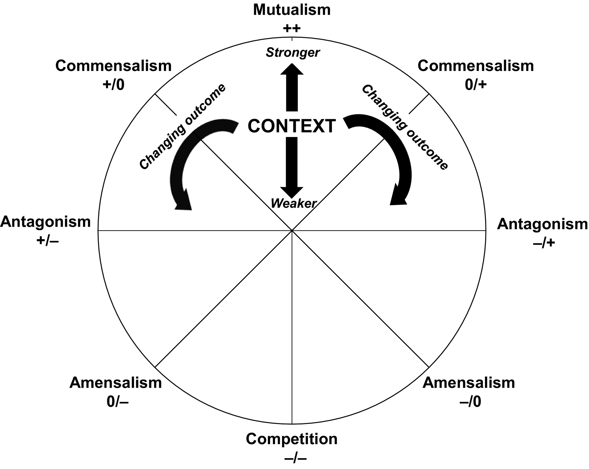

```{r knitr_options, include=FALSE}
library(knitr)
opts_chunk$set(fig.align='center', cache = FALSE, warning = FALSE,
        message = FALSE, echo = FALSE, out.width = '95%')
options(digits = 3, width = 88)
if(!require(bookdown)) install.packages("bookdown", repo="http://cran.us.r-project.org")
```


\thispagestyle{fancy}

# Reading:

Purugganan, Mary, and Jan Hewitt. "How to read a scientific article." Rice University (2004). [pdf](http://www.owlnet.rice.edu/~cainproj/courses/HowToReadSciArticle.pdf)


Ecological Society of America. What does ecology have to do with me? [pdf](https://www.esa.org/about/what-does-ecology-have-to-do-with-me/)


## Defining the discipline

Ecology is the study of species interactions. Species interact with themselves through birth/death processes and population regulation, with other species through multiple symbioses (mutualism, parasitism, commensalism, amensalism), and with the environment. Interactions with the environment can often go both ways, where a species can physically modify environmental conditions, resulting in an interaction effect of the species on the environment. Further, environmental conditions determine which species can occur in which areas (e.g., a polar bear would not do so well in the tropics). Ecology is a pretty general discipline, in that it covers scales from individuals up to the entire planet, and intersects with multiple other scientific disciplines, including geography, epidemiology, and evolution.


```{r fig1, out.width = '100%'}

```
adapted from https://doi.org/10.1111/fwb.13476 (who adapted it from Haskell 1943)


## What ecology isn't

+ _Environmentalism_ is not ecology, but is a discipline which utilizes information from conservation ecology and environmental policy to affect public change or lessen human effects on the environment. 

+ _Biomedicine_ is the application of biology to create medical treatments. 


+ _Epidemiology is the study of infectious disease, almost entirely on humans (sometimes domestic animals) with a focus on mitigation and control. There is also some overlap with ecology, as the subdiscipline of _disease ecology_ borrows epidemiological theory to explore how ecological processes (e.g., competition, predation, abiotic stress) contributes to disease in human, animal, and plant populations. 


+ _Natural history_ is a the descriptive study of natural systems. While incredibly useful to ecology, and honestly some of the foundation of ecology as a discipline, the field of ecology has since gone beyond the description of natural systems and into more hypothesis-driven science. 


+ _Evolution_ is quite closely related to ecology, but is still slightly separate. Evolution relates to changes in allele frequencies over time. This is related to ecology for a number of reasons, most importantly because genetic diversity affects population demographic rates, and phylogenetic relationships between organisms affect species traits and interaction strengths. There is an entire subdiscipline in ecology relating to eco-evolutionary dynamics. In this course, we will not go over evolution all that much, instead focusing mostly on population and community dynamics in the absence of evolutionary processes. Some may think this is a mistake.  


## Levels of biological organization


+ _Individual_: a form of life considered as an entity (e.g., an animal, plant, fungus, protist, or bacteria) 


+ _Population_: all of the individuals of a species that live in the same area 


+ _Community_: collection of all the different populations that live in one area


+ _Ecosystem_: a community of living organisms and their interrelated physical and chemical environment 

+ _Biome_: distinct ecological communities of plants and animals living together in a particular climate


+ _Biosphere_: all the organisms and the part of Earth where they exist 


## The problem and fun of scale in ecology

There are many different scales at which we do ecology. Scale has been a common theme in ecological analyses, as we often find _scale-dependence_, in that a process important at smaller spatial or temporal scales may not be important at different scales. 

+ _spatial_ scale relates to the geographic extent of the ecological process. For example, a species may be able to only occur in a subset of habitats. If we were to sample a small geographic extent (i.e., one measure of spatial scale), we might conclude that the species is found in a smaller subset of habitats than it actually is found. This becomes especially true when we think about invasive species, where different ecological processes may control population dynamics of a species differently in the native and introduced geographic area (e.g., how might this manifest?). 

+ _temporal_ scale refers to the time-dependence of many ecological processes. Ecological processes may change seasonally or annually, resulting in potentially different conclusions about the dominant forces constraining a given process. For example, species that are abundant in one year might not be abundant in the next, such that drawing conclusions about competitive processes or population dynamics in a single year may lead to different conclusions dependent on the year of sampling. 


## What impact do humans have on natural systems at each level of biological organization?

_Biotic_ versus _abiotic_ variables: Biotic variables refer to living things which influence one of the levels of biological organization discussed below. For instance, the density of a species may influence the abundance of a prey resource. Abiotic variables are non-living, and are often used in terms of climatic variables. For instance, the prey resource in the previous example is influenced by temperature, precipitation, and soil conditions. 


_Individual_: 
Human-induced changes to the landscape, such as through agriculture or construction, can result in changes to individuals behavior and the interactions between species. For instance, hummingbird-plant interactions were found to increase in the present of noise pollution (https://doi.org/10.1098/rspb.2012.0230). Food supplementation, either intentional or accidental, may increase disease risk by modifying individuals social behavior (https://doi.org/10.1890/060152). 


\bigskip


_Population_:
The same changes influencing individual behavior can scale up to populations. Apart from the effects of human-induced changes on individual behavior, a direct effect of altered mortality/survival can strongly influence population dynamics. For instance, nutrient pollution from agricultural or residential runoff causes populations of algae to have increased growth rates (https://doi.org/10.1007/BF02804901)

\bigskip

_Community_:
Communities may be influenced by human-induced changes through differential sensitivity to modified landscapes. Some species are really good at adapting to modified landscapes. Let's consider community composition along a urbanization gradient. In cities, we largely see squirrels, pigeons, etc., while in more natural areas, we could expect to see a different set of species (e.g., deer, some hawk and snake species, etc.)

\bigskip

_Ecosystem_:
Ecosystems are influenced by human-induced changes by alterations in biogeochemical cycles. For instance, the nitrogen cycle is a way to understand how nitrogen goes through different functional forms in the ecosystem, which is important as nitrogen can influence primary productivity of plants and decomposition rates. 

\bigskip


_Biome_: 
It is difficult to study entire biomes, but human-induced changes do disproportionately affect certain geographic areas over others. For instance, the rate of change in temperature and precipitation is strongly related to latitude, meaning that more poleward areas tend to experience more rapid climatic change. 


\bigskip


_Biosphere_:
Given that human-induced changes may lead to changes in all previous levels of biological organization, it is clear that these changes manifest at the biosphere scale. That is, human-induced changes may be local, but are numerous and diffuse, leading to issues scaling to the planetary level. An example of this is the Great Pacific garbage patch, a massive 1.6 mil km2 area of plastic pollution off the coast of California. 


## How do we do ecology?

Science is an inherently iterative process. Scientists form a \textit{hypothesis}, or a falsifiable statement concerning how a system works. That is, the hypothesis is not simply an idea of how something might work, but a clear statement. What are some other aspects of good hypotheses?

+ Testable (concepts need to be operationalized and quantified)
+ General (not specific to a single area or occurrence)
+ Falsifiable (able to be demonstrated untrue)
+ Plausible (should not defy logic)


Alright. So no we have an idea of how a system works, and we form it into a hypothesis. We test this hypothesis using a variety of observational or experimental approaches. 


_Observations_: This is perhaps the original form of ecological reasoning. We go out and measure some aspect of the natural system, and come to some conclusion about it. Much of ecology sort of started here. Bergmann's rule (body size variation across latitudinal gradients). What are some of the downsides of the observational approach?


_Field experiments_: To account for the issues in ascribing a mechanism based on an observational study, a second way scientists investigate is through field experimentation. This is also referred to as manipulative experimentation sometimes, and is when the researcher changes or controls some aspect of the natural system, allowing the researcher to estimate the influence of some variable ($x$) on some response ($y$). (e.g., pisaster and Paine). What are some issues with field experiments?


_Laboratory experiments_: Laboratory experiments allow researchers to control all environmental and genetic variation, isolating the effect of some variable $x$. Further, $x$ can be manipulated across ranges or temporal patterns that cannot be observed in natural systems. So while temperature and precipitation may be spatially autocorrelated and collinear temporally, in the lab you can separate those variables, allowing the relative effect of each to be quantified. What are some issues with laboratory experiments?


_Ecological modeling_: Ecological modeling involves the formulation of ecological systems in more simple, often mathematical, terms. I use ecological modeling here to refer to the development of theoretical models concerning how a system works, which can then be simulated and examined in more detail. Predictions from these ecological models may be tested against what is seen in natural systems, and models can be fit to data from natural systems. Ecological modeling is the closest mode of investigation to underlying theory in ecology, which may be initially informed by any of the forms of scientific investigation discussed here, but often is refined by the use of ecological models. A good example of an ecological model is the SI or SIR model.


$$ S_{t+1} = bS_{t} - \beta S_{t} I_{t} $$

$$ I_{t+1} = \beta S_{t}I_{t} - \gamma I_{t} $$ 


This model can be used to explore the effects of population size, transmission rate and recovery rate on epidemic dynamics, and is incredibly useful and flexible to the incorporation of other variables. This can make predictions about how big an epidemic may become given these parameters. Disease mitigation strategies can be implemented or informed by these models. Finally, data from real world epidemics may be used parameterize models. Simulations based on these parameterized models can start to get at the inherent randomness/predictability of epidemic dynamics. 


---
# the issue of ascribing causality from observational studies (ties into the issues of scale as well)
# -- the ecological fallacy
# --  inferences about the nature of individuals are deduced from inferences about the group to which those individuals belong. This comes in a variety of flavors, so I would only expect you to know the ecological fallacy in general, but one really poignant form of the ecological fallacy is called Simpson's paradox.  "a trend appears in several different groups of data but disappears or reverses when these groups are combined."
---


## How do we read a scientific paper? 

A discussion based on our reading of the 'how to read a scientific paper' from the assigned reading from this week. 


---
# how to read a scientific paper
# 1. Skim the article and identify its structure
##   intro (+thesis), methods, results, discussion 
# 2. Distinguish main points
# 3. Generate questions and be aware of your understanding
## why did the authors do this? Does this assertion match the citation or data? what is the context of the article (how does this push the science forward)?
# 4. Draw inferences.
## what have you learned? (related to generating questions, and the idea that reading is an active process different from reading of fiction or textbooks)
# 5. Take notes as you read. 
## These are good to save for later, as research builds on itself. You will forget the main point of an article within a week or so of reading it, but if you write it down, it may last a bit longer. 
---


