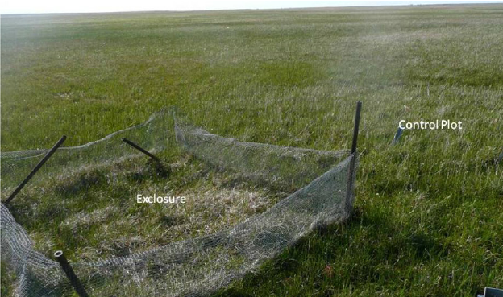
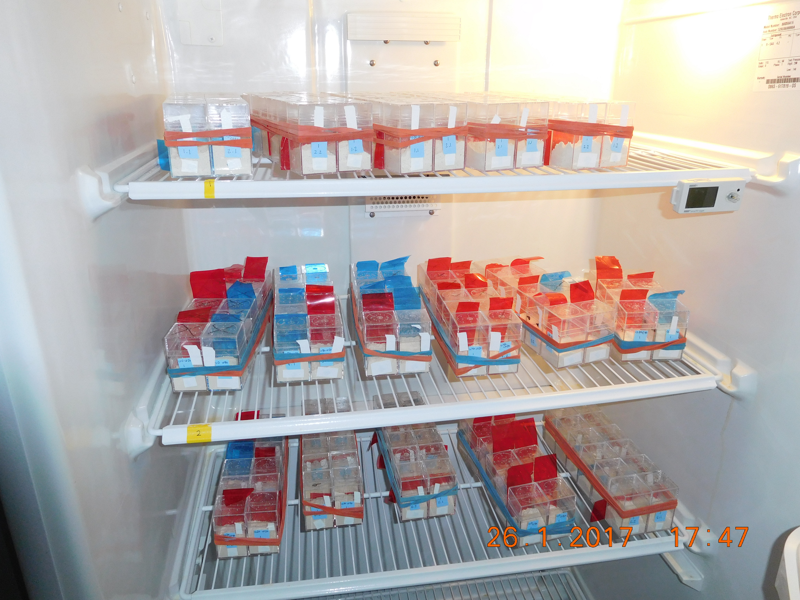

class: left, middle


```{r setup, include=FALSE}

options(htmltools.dir.version = FALSE)
knitr::opts_chunk$set(fig.align='center', echo = FALSE, out.width = '95%')

```


class: left, center, inverse

.font300[Announcements]  
+ 
+ 
+ 


---

background-image: url('figs/tad.jpeg')
background-position: 50% 50%
background-size: contain
class: center, top, inverse

.font300[Introduction to me]  


---

background-image: url('figs/deerclosure.png')
background-position: 50% 50%
background-size: contain
class: center, middle, inverse

# .font300[Syllabus]  


---

background-image: url('figs/deerclosure.png')
background-position: 50% 50%
background-size: contain
class: center, middle, inverse

# .font300[Final project]  


---

# Readings

.font200[Purugganan, Mary, and Jan Hewitt. "How to read a scientific article." Rice University (2004). ]
<https://www.owlnet.rice.edu/~cainproj/courses/HowToReadSciArticle.pdf>


.font200[Ecological Society of America. What does ecology have to do with me?] 
<https://www.esa.org/about/what-does-ecology-have-to-do-with-me/>


---

# That's all for today


---

## What is ecology? 

### The study of interactions between biological organisms and their environment.

---

## Interactions with same species

+ .font200[Competition]
  + food
  + space
  + mates
+ .font200[Cannibalism]
+ .font200[Dispersal processes]

---

## Interactions with different species

+ .font200[Competition]
+ .font200[Predator -- prey]
+ .font200[Plant -- pollinator]
+ .font200[Host -- parasite]


---

## Interactions with the environment

+ .font200[Allelopathy]
+ .font200[Thermal tolerance]
+ .font200[Disturbance ecology]
+ .font200[Dispersal limitation]
+ .font200[Ecosystem engineers]


---

# Environmentalism

### A political and social ideology seeking to limit human impact on the environment


---

# Biomedicine

###  Gets conflated with ideas of "mainstream medicine"
### Generally applies to clinical practice and only to human populations (can some part of the environment make me better?)
 


---

# Natural history

### Descriptive study of natural organisms 

### Slightly separate from ecology, though ecological studies often utilize museum collections, and museum collections are essentially natural history storehouses


---

# Evolution


### Change of allele frequencies over time

### Strong feedbacks with ecological processes

>  "Nothing in Biology Makes Sense except in the Light of Evolution"
- Theodosius Dobzhansky


---

# levels of biological organization


---

# Individual 

### A single individual of a species.  

### e.g., a single trout in lake superior


---

# Population

### A collection of individuals that occupy a given geographic area and interact with one another.

### e.g., trout in lake superior


---

# Community 

### A set of interacting species that occupy a given geographic area.

### e.g., fish communities in lake superior


---

# Ecosystem

### The set of interacting species (the community) and the interactions between these species and their physical environment. 


---

# Biosphere

### The global environment, consisting of all living things on the planet.

### e.g., the planet


---

# What is the role of the environment and land use change to each level?


---

background-image: url('figs/individual.png')
background-position: 50% 50%
background-size: contain
class: top, right, inverse

## Individual


---

background-image: url('figs/population.jpg')
background-position: 50% 50%
background-size: contain
class: top, right, inverse

## Population

---

background-image: url('figs/community.jpg')
background-position: 50% 50%
background-size: contain
class: top, right, inverse

## Community 


---

background-image: url('figs/ecosystem.jpg')
background-position: 50% 50%
background-size: contain
class: top, right, inverse

## Ecosystem


---

background-image: url('figs/globalRisk.png')
background-position: 50% 50%
background-size: contain
class: top, right, inverse

## Biosphere


---

# How do we do ecology?


---

## Observations


---

## Manipulative experiments




---

## Laboratory experiments




---

## Ecological modeling 


