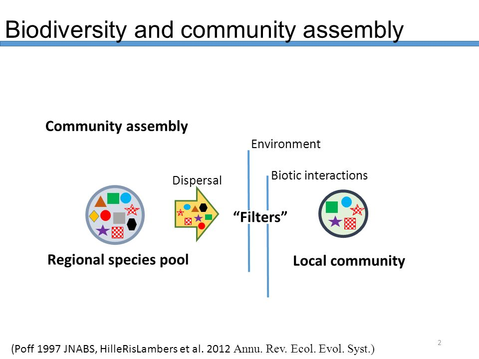
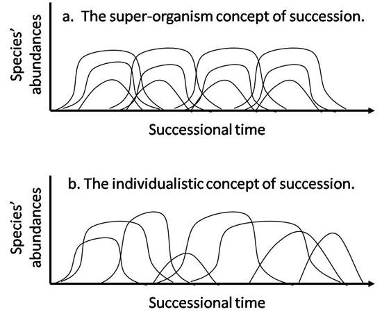

```{r knitr_options, include=FALSE}
library(knitr)
opts_chunk$set(fig.align='center', cache = FALSE, warning = FALSE,
        message = FALSE, echo = FALSE, out.width = '95%')
options(digits = 3, width = 88)
if(!require(bookdown)) install.packages("bookdown")
```


\thispagestyle{fancy}

# Reading:

Emery, S. "Succession: a closer look." Nature Education (2010). [link to reading](https://www.nature.com/scitable/knowledge/library/succession-a-closer-look-13256638)

\bigskip

Gotelli, Nicholas J. A primer of ecology. Sunderland, MA: Sinauer Associates, 2001. Chapter 9.


\clearpage


## What controls the structure of ecological communities?

In previous lectures, we focused on the species niche, or the set of abiotic (and biotic) variables which constrain the persistence of a species in a multi-dimensional space. Today, we'll use similar concepts to build up from single species to interacting communities. An _ecological community_ is a set of interacting species which utilize the same environment. The term community is typically applied to a set of species which occupy the same \textit{trophic level}. This is perhaps a more restrictive definition than some have given, with the most liberal definition of the community being all interacting species in an area, which would include the entire _food web_. This includes all _consumer-resource interactions_ (which include predator-prey, plant-herbivore, and host-parasite interactions). But we will discuss these trophic relationships later, and will focus on the community of species which all occupy the same trophic level. 


\clearpage


## Species communities

The geographic distribution of species is set by their abiotic tolerances (based on the idea of the niche). Let's consider a set of species with slightly different niches, and corresponding slightly different geographic distributions. Sampling a fixed area, it is possible to observe anywhere between 0 and $S$ species, where $S$ is the total number of species across the landscape. But species compete, and in the long-term one species will always win and exclude other species based on R* theory, assuming a common limiting resource ($R$), or there will be a region of stable coexistence, as identified in the Lotka-Volterra model. 


It is important to consider how we describe the diversity of these multi-species communities. Below, I'll talk about three main forms of diversity measurement that vary in scale from local to regional. Then we'll go into successional processes, and how they generate temporal patterns in community composition.  


\bigskip


## Different scales of diversity

How do we describe communities, and the relationships between pairs of communities? The set of species in the landscape (as described above) captures the regional diversity (also called _gamma_ $\gamma$ diversity). At each site, the observed species diversity is called _alpha_ $\alpha$ diversity. The difference between semi-independent sites (as they should be connected by dispersal, but at an appropriate spatial scale so as not to be too small) in species composition is termed _beta_ $\beta$ diversity.


### Measuring species diversity (alpha)

Imagine species diversity as a large collection of jelly beans in a bowl, where each jelly bean is an individual, and colors correspond to species. Pulling out a handful -- corresponding to a _sample_ -- and enumerating the species (alpha diversity) may not give you a picture of the actual richness of the community. This is especially true if the relative abundance of the species (different colored jelly beans) varies. Rank abundance plots are one way to examine this, where the shape of the distribution tells us something about commonness and rarity in the system. That is, some environments promote the dominance of a single species relative to a large group of rare species, while other environments may promote more equitable distribution of species abundance. 


This is especially important, as rare species will be less often sampled, making estimates of alpha diversity incorrect if we assume that all species have equal abundance. These differences in relative abundance cause a community to be "uneven", where _evenness_ is defined as the tendency for a community to be composed of approximately equal numbers of individuals (a two species community composed of 20 individuals of species A and 20 individuals of species B). 


So how do we get around the issue of a sample not representing the _true_ community? We can estimate the likely number of species in the community by using either rarefaction, or species richness estimators. 


#### Rarefaction

_Rarefaction_ is the process of subsampling the data (taking less than the sample) and estimating species richness for each subsample of $n$ individuals. Rarefaction can exist in at least two forms; individual-based and sample-based. Individual-based rarefaction (which is what we'll focus on) rarefies as a function of individuals (i.e., the unit of interest is the sampled individual). Sample-based rarefaction focuses on the entire sample, which is composed of multiple individuals, potentially of different species. The difference between these two depends on the structure of the data available, and the goal of the researcher. That is, if I want to know how many sampling plots I should examine in a forest if I wanted to fully capture species richness, I would use sample-based rarefaction. If my experimental design consisted of sampling individuals (e.g., small mammal trapping in a single site), then individual-based rarefaction would be more appropriate. 


If we consider a fine enough gradient of $n$ values, we can build up a saturating curve relating species richness (our quantity of interest) to the number of individuals sampled. From this curve, we can ask how many species we would expect to observe if we sampled more individuals than we actually did. 


#### Assumptions of rarefaction:

+  underlying community is constant over time (no immigration or emigration of species)
+  well-mixed community (spatial distribution of each species is random)
+  individuals are sampled at random (brighter colored individuals aren't sampled more often than others)
+ sampling with identical methods (if used to compare two communities)


Apart from the simulation-based approach to rarefaction, there is also a decent approximation of the expected value of species ($S_{m}$) expected to be found of $m$ individuals. 

\[ E(S_{m}) \approx S - \sum_{i=1}^{S}(1-p_{i})^{m} \]

where $S$ is the number of species, $m$ is the total number of individuals in the sample, and $p_i$ is the proportion of species $i$ in the original sample. 


#### Rarefaction as a way to compare richness between sites

What is we want to know how two sites compare in the number of species which live there, but we have sampled them unequally? We can use rarefaction as a way to subsample the more well sampled community and generate a bootstrapped species richness distribution. 


#### Species richness estimation

Rarefaction is largely used for interpolation (what is the number of species I would expect to find in this smaller sample than what I took?). Species richness estimators are used for extrapolation (given I found this many species in this sample, how many species are in the entire area?). We are normally far more interested in extrapolation than interpolation. 


One common estimator of species richness is called the Chao1 index, named after and by Anne Chao. It's based on the number of singletons (those species that are represented by a single individual in the sample) and doubletons (those species that are represented by two individuals in the sample). Essentially, the estimator attempts to quantify how often rare species are found, and to extrapolate based on these rare species. A modified ratio between the singletons and the doubletons is used to tell us something about the total number of species, by trying to estimate the number of species in that tail (those that are really rare and infrequently sampled). 


\[ S_{est} = S_{obs} + \left( \frac{(f_{1})^{2}}{2f_{2}}\right)\]


\clearpage

### Measuring species diversity (beta)

But species richness (alpha diversity) was only one type of diversity we discussed. While alpha diversity is the property of a single community, we often need a way to compare communities. Beta diversity is also called "species turnover", as it attempts to estimate the relative amount of shared species and unique species for any pair of communities. 


Jaccard similarity: bounded between 0 and 1. Is equal to 1 when two communities are identical, and 0 when the communities share 0 species. 


\[ J(A,B) =  \frac{| A \cap	 B |}{| A \cup B|} \]


$| A \cap	 B |$ is the shared species between communities $A$ and $B$, while $| A \cup B |$ is the total number of shared and non-shared species. 


#### Distance-decay in community similarity

We can consider a set of communities potentially connected by dispersal processes (i.e., immigration and emigration occur). A common observation in the spatial structure of communities is that distance between two communities is negatively related to the similarity of the two communities. That is, communities which are farther apart tend to be more dissimilar than two communities which are close together. This can happen for a number of reasons, including 1) dispersal limitation or  2) a spatially-autocorrelated environmental landscape, among some others that I can't think of now.


```{r fig3, out.width = '100%'}
knitr::include_graphics("figs/distdecay.jpg")
```
This figure is from [this PNAS paper](https://www.pnas.org/content/109/20/7787)


### How have alpha and beta diversity changed over time?

Dornelas et al. 2014 [link to paper](www.doi.org/10.1126/science.1248484) paper showing little evidence for a net change in species richness (alpha diversity), but a clear increase in community similarity (beta diversity).  (i.e., communities are becoming more homogeneous, and some species are lost, but invasive species or common species are filling those gaps). 


\clearpage


### Community composition and assembly


Community composition describes the number of species within a given community, and is typically treated as presence-absence data (a species is either there or it is not) without consideration of species abundance. We talked about species richness (alpha diversity), which is a coarse measure of a community. Community composition typically considers the identities of species in the community. Species play different roles in ecological communities. 

For instance, a _keystone species_ is a species that has a large impact on community structure relative to it's abundance in the community. An example would a top predator (like a sea star), which eats mussels. The removal of this sea star species results in the mussel population growing and excluding over 20 species. 

Another type of species that can play a substantial role in determining what species can exist within the community are _foundation species_. These are species which provide necessary resources like habitat to other species. An example would be a bird that creates holes for other species to live in as a consequence of foraging behavior of the bird. 


So what determines community structure? 

+ environmental conditions
+ geographic location of site
+ species interactions
+ regional species pool 


```{r fig4, out.width = '100%'}

```


But what if we consider _community assembly_ instead of composition? That is, community composition is the set of interacting species which make up the community at a single point in time, under the assumption that all species may arrive at the site. _Community assembly_ is the set of processes by which communities are formed. Including this temporal axis is important, as each snapshot in time of a community can tell something about the community composition, but examining change in communities through time allows for examination of community assembly. One way community assembly can occur is through succession.


### Succession

Imagine a community assembly process on a large area of land that recently had a large disturbance event (e.g., a large fire removed all species from an area). This area will be re-colonized by species from the regional species pool, and the order of arrival of species allows the study of community assembly. This community assembly process is also called \textit{succession}. Succession can either be primary (as described above where all species are removed) or secondary (where a subset of species remain after a disturbance event). The idea of succession was formed early in the history of ecology, and was developed mainly using plant communities as an example. There were two main people involved in early ideas of succession; Gleason and Clements. Clements argued that successional dynamics were deterministic, where a disturbed site will eventually reach a \textit{climax community} that is a stable assemblage. Meanwhile, Gleason posited that species responded individually to environmental gradients, such that successional dynamics were a process related to the species abiotic tolerances (i.e., their niche). Ecologists have largely abandoned the idea of the \textit{climax community} and the deterministic view of succession. Instead, we recognize the importance of chance, species differences in colonization rates and competitive ability, and site-level variation in environmental factors across successional time. 


```{r fig2, out.width = '100%'}

```


In the 1970's, Levins developed the idea of a species tradeoff which could explain successional dynamics without invoking changing environmental conditions. The idea was that early colonizing species after a disturbance tended to be 'weedy' species, that could disperse and grow quickly (in the case of plants), but that were poor competitors. Meanwhile, good competitors did not disperse and colonize as well, and took longer to arrive at a disturbed patch. However, once they did arrive, they would outcompete the early colonizing species, resulting in replacement of species through time (i.e., successional dynamics). This species tradeoff -- species are either good at colonizing sites or good competitors -- is referred to as the _competition-colonization tradeoff_. 


#### Autogenic succession
A term where successional dynamics are driven by the identities of species in the communities altering the competitive landscape. This is essentially a form of historical contingency. An example would be if a large plant with big leaves established in a early successional plot, shading out plants that require lots of light, but allowing shade-tolerant plants to invade.  


#### Allogenic succession 
A term where successional dynamics are driven by temporal environmental changes. Environmental conditions (soil moisture, N availability, etc.) will change over time in successional plots, as succession is typically examined after a large disturbance event (e.g., a fire). 


Another interacting force, slightly on the other end of the deterministic--stochastic spectrum, is the neutral theory of biodiversity, which predicts that community assembly occurs through stochastic processes. That is, whichever species get to a new site will colonize it, and will persist independent of any historical contingency (i.e., priority effect). This is because neutral theory asserts that species have equivalent demographic rates and dispersal rates. The environment can only support so many individuals, which controls the overall number of organisms in the community. Changes to the community happen through probabilistic processes (i.e., stochasticity as we discussed in previous lectures). Specifically, demographic stochasticity, as the environment can be assumed to be constant and/or non-limiting to any one species (i.e., no niche limitation present). This is a pretty big assumption depending on the scale at which the community is examined. 


### Why aren't all communities predictable?

But if we know the regional species pool and the colonization and competitive ability of all species, could we then predict community assembly (successional) processes? No...or at least not in the deterministic sense that earlier ecologists proposed with respect to things like succession. 


And there are at least two reasons for this; species may fundamentally change the environment they colonize, making the order of colonization extremely important (remember here that dispersal is a stochastic process, where competition-colonization tradeoffs exist, but are hardly absolute). This effect of the order of arrival of species to a site is called _historical contingency_ or a _priority effect_. The second reason community composition and assembly processes may not be predictable is due to stochasticity. That is, the dispersal and establishment of species to a site is not deterministic, but is probabilistic. Further, the outcome of competition between species is often probabilistic (recall that in Lotka-Volterra competition, the initial number of individuals of the $n$ species determined the outcome of competition. 


#### Historical contingency or priority effects 
As noted above, the order of species arriving to a given site may strongly influence the equilibrium community composition later in time. Without detailed knowledge on the order of arrival of species, as well as the complex relationships between species, it is difficult to estimate the probability that a dispersing species will establish in a site. This is further influenced by the \textit{propagule pressure} or the number of individuals or the frequency of dispersal events into a patch. The existing community's ability to reduce the success of the dispersing species is referred to as \textit{biotic resistance}. 


#### Stochasticity 
We touched on the influence of stochasticity in earlier lectures on population dynamics. Stochasticity relates to the inherent randomness in integer-valued probabilistic processes like birth and death (e.g., distribution of offspring is not a single number). Stochasticity also influences the structure of ecological communities, as competition among species may decrease population sizes, which increases the role of _demographic stochasticity_, leading some species to go extinct in unpredictable ways. The lack of ability to predict which species in a competitive system will go extinct is called _competitive indeterminacy_. \\ 

