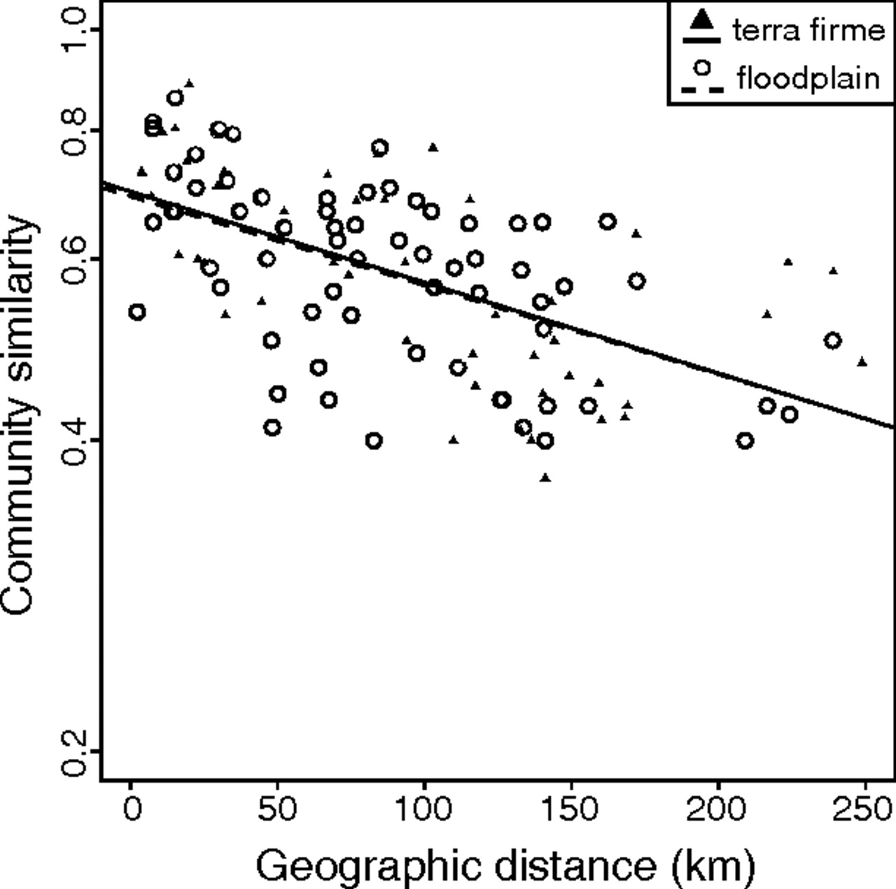

class: left, middle


```{r setup, include=FALSE}

options(htmltools.dir.version = FALSE)
knitr::opts_chunk$set(fig.align='center', echo = FALSE, out.width = '95%')

```


class: left, center, inverse

.font300[Announcements]  
+ 
+ 
+ 


???
Comment


---

```{r out.width='75%'}
knitr::include_graphics('figs/commAssembly.jpg')
```


---

```{r out.width='75%'}

```


---

```{r out.width='75%'}
knitr::include_graphics('figs/succession.jpg')
```


