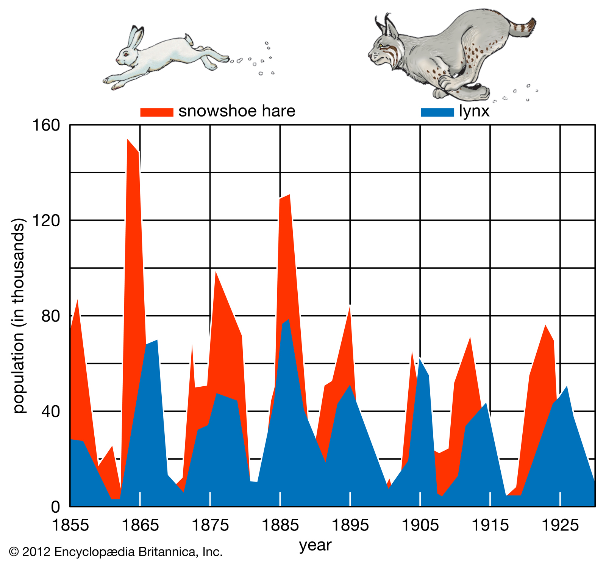
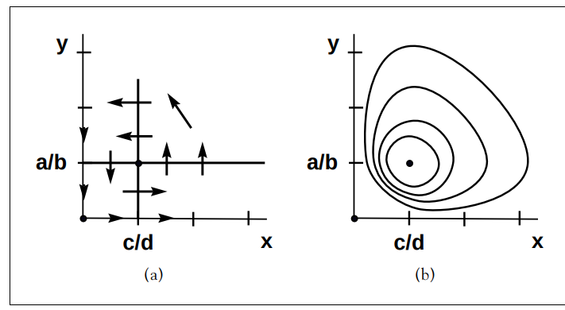
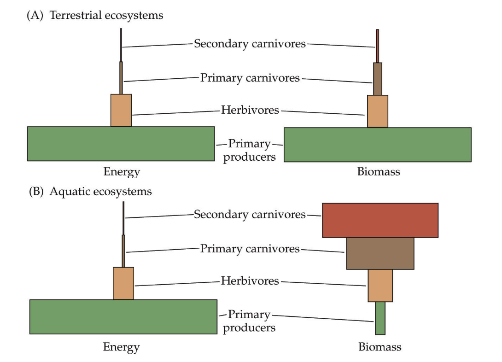

```{r knitr_options, include=FALSE}
library(knitr)
opts_chunk$set(fig.align='center', cache = FALSE, warning = FALSE,
        message = FALSE, echo = FALSE, out.width = '95%')
options(digits = 3, width = 88)
if(!require(bookdown)) install.packages("bookdown")
```

\thispagestyle{fancy}

# Reading:

Gotelli, Nicholas J. A primer of ecology. Sunderland, MA: Sinauer Associates, 2001. Chapter 6. pages 1-14. 


# What controls consumer-resource interactions and dynamics?

This week, we'll look at consumer-resource interactions a bit more explicitly. These were mentioned briefly along with food webs in the community lecture, but now we'll go into more detail. Consumer-resource interactions are a broad class of interactions that include predator-prey, plant-herbivore, and host-parasite interactions. The availability of resource fundamentally constrains the number of predators that can exist. In the logistic model, we assumed that population dynamics were constrained by some carrying capacity $K$, which could be driven by resources, but we did not consider resources explicitly. The availability of resources strongly influences predator populations. 

```{r fig1, out.width = '100%'}

```

Let's see what happens to single species population dynamics when we do consider the resource population explicitly. We'll start by considering the _Lotka-Volterra model_, which tracks consumer ($C$) and resource ($R$) populations through time. 

The model makes several simplifying assumptions: 1) the prey population will grow exponentially when the predator is absent; 2) the predator population will starve in the absence of the prey population (as opposed to switching to another type of prey); 3) predators can consume infinite quantities of prey; and 4) there is no environmental complexity (in other words, both populations are moving randomly through a homogeneous environment).

So let's first consider the case of the consumer in the absence of the resource. 

\begin{equation}
\frac{dC}{dt} = -qC
\end{equation}

where $q$ is the consumer ($C$) mortality rate. Without resources, the consumer will decline exponentially to extinction. Now we'll add resources into the consumer equation.

\begin{equation}
\frac{dC}{dt} = caCR - qC
\end{equation}

Here, the term $caCR$ corresponds to the attack rate ($a$) times the conversion of food into offspring ($c$) times the abundance of both consumer $C$ and resource $R$. 

\noindent\fbox{%
    \parbox{\textwidth}{%
Recall the consumer-resource model we discussed earlier in terms of R\* theory. These models are very similar, except there is now only 1 consumer ($N$ in the R\* theory now becomes $C$ in this model), and we treat conversion efficiency in the R\* model ($a_j$) as the product of two terms (the attack rate $a$ and the conversion efficiency $c$). 

$$\frac{dN}{dt} = N_{j}(a_{j}R - d)$$

$$\frac{dR}{dt} = r - R\sum_{j} a_{j}N_{j}$$

  }
}

This suggests that consumer population growth is fundamentally and closely linked to the abundance of resource $R$. The population dynamics of the resource population are similar to those of consumer, except there is no assumed background mortality rate. Instead, the population $R$ grows exponentially at rate $r$, but the population is reduced by the effect of the consumer ($aCR$). That is, 

\begin{equation}
\frac{dR}{dt} = rR - aCR
\end{equation}

Depending on the parameterization of the model (e.g., attack rate $a$, conversion rate $c$, growth rate of the resource $r$, etc.), this model can display a range of dynamic behaviors. One interesting result from this simple model is the existence of sustained oscillatory behavior. The behavior is caused by the inherent feedback between consumer and resource. That is, the consumer and resource oscillate together through time, with the consumer lagged forward in time relative to the resource dynamics. This suggests that resource populations drive consumer dynamics, where resources are allowed to increase at relatively low consumer abundance, but high resource abundance increases consumer populations, which serves to drive down resource populations.

This behavior has been observed in real consumer-resource systems as well, supporting the theoretical expectation derived from the Lotka-Volterra model. 

## Equilibrium consumer 

\begin{align}
\frac{dC}{dt} & = caCR - qC   \\
0 & = caCR - qC \\
caCR & = qC \\
caR & = q \\
R* & = \frac{q}{ca} 
\end{align}

## Equilibrium resource

\begin{align}
\frac{dR}{dt} & = rR - aCR \\
0 & = rR - aCR \\
aCR & = rR \\
aC & = r \\
C* & = \frac{r}{a} 
\end{align}


<https://statisticalplumber.shinyapps.io/lotka/lotka.Rmd>


```{r fig2, out.width = '100%'}

```

## Model assumptions:

- Resource population only limited by predator
- Predator ($C$) only eats the one resource $R$
- Individual predators consume infinite number of $R$
- Encounter of predator $C$ and resource $R$ is random and "well-mixed"


## Functional response

Type I: this is what we assume above in the simple model. That is, there is a linear relationship between the number of prey ($R$) consumed and the density of predators $C$.

Type II: this functional response is saturating, such that at high predator $C$ density, consumption of prey is reduced (i.e., predators are limited in the capacity to "process" food, or prey become harder to find/attack when predator density is high).

Type III: this functional response is not often observed, but is similar to type II (so there is saturation). However, before this saturation, there is an exponential increase of prey consumed as a function of predator density. This could be the case if a certain density of predators is required to best attack a resource (e.g., maybe 1 or 2 wolves can't take down caribou effectively, but there is some intermediate density where hunting strategy is more effective. After this density, there is a saturating response, as more predators doesn't mean more prey consumption).


# Food webs and their structure

The Lotka-Volterra model examines the interactions between a single consumer and resource species. What if we scale this up to a set of interacting consumer and resource species? While models exist to describe these interactions (especially in the case of a single resource population with many consumers), we will discuss this situation in more conceptual terms. The feeding interactions across _trophic levels_ form the _food web_, which describes all the trophic interactions among species in a given location.

More information on food webs can be found at this link <https://www.nature.com/scitable/knowledge/library/food-web-concept-and-applications-84077181/>.

Here, the food web is depicted as a graph (a network), where nodes of the network are species and links are directional feeding associations describing the flow of energy from one species to another via a "feeding" interaction. Food webs are typically broken down into trophic levels, forming a _trophic pyramid_ where each level of the pyramid corresponds to a set of species which occupy the same trophic level. The base of the food pyramid (or food web) is most commonly composed of _autotrophic_ species -- also called primary producers -- which are photosynthetic organisms. The next trophic levels consist of _heterotrophic_ species. The immediate next level are often the small herbivores which consume the autotrophs, and after them are the _primary predators_ who consume the herbivores. After this are _secondary predators_ and so on.

Some have also described two different types of food webs; _green_ and _brown_. Green food webs scale up from autotrophs to herbivores and larger bodied species. The brown food web corresponds to the detrital food web, consisting of dead organic matter (detritus) and the organisms which break this down or consume species which break down detritus. 


# Types of food webs

**Connectedness food web**: feeding relationships, as described above. This is the most common type of food web. 

**Energy flow food web**: defines connections as dominant sources of energy transfer. So this removes some feeding links which don't contribute strongly to the conversion of biomass up trophic levels. 

**Functional food web**: tracks influence of populations on growth rates.


# What controls food webs?

But why do we depict food webs as pyramids in the first place? It's a natural way to showcase the flow of energy to higher trophic levels, but it also often corresponds to the reduction in species richness at each trophic level. That is, there are often many autotrophic species, while there are typically very few secondary predator species. In fact, the total number of trophic levels is fundamentally limited by the flow of energy. 

To explore this more, we'll consider how each trophic level in the pyramid differs in terms of overall abundance and biomass. In terms of abundance, the pyramid shape is maintained, with lower trophic levels typically being overall more abundant. This relationship is even more pronounced when we consider biomass, as autotrophic species generally have quite high biomass. So why is this pyramid shape maintained? 

Every trophic interaction represents a flow of energy from one level to the next. But these interactions aren't without waste. That is, the ability of the consumer to convert the resource into energy is not 100\%, and consumers need to consume many resource items to create one new consumer (as we saw in the Lotka-Volterra model). This trophic difference in ability to capture energy is sometimes referred to as the _pyramid of productivity_, which posits that energy transfer between trophic levels to create consumer biomass results in only 10\% of the consumed energy used to create new consumer biomass. This suggests that each trophic level will be 10\% of the size of the previous level. This is an oversimplification, but it's also a good piece of conceptual theory. This also helps explain why food webs tend to have fewer than five trophic levels, as starting with an autotrophic biomass pool of 100,000 units will result in 10 units of predator biomass in the fifth trophic level. 

The environment may also constrain food web structure. In fluctuating environments, food webs tend to be smaller and have lower connectance (so there are fewer species, and the species that are present tend to specialize in terms of who they eat).  


# What controls food web size?

**Energetic hypothesis**: there is a limited amount of energy in the environment, and the percent energy transfer (as described above) controls food web size. If energy increased, this should result in longer food chains and more species

**Dynamic stability hypothesis**: Disturbances at lower trophic levels are magnified up the food web, constraining the number of trophic levels possible. This is an explanation for the observation that food chains tend to be shorter in fluctuating environments. If environmental conditions fluctuating strongly, weaker interactions should be removed from the food web, lowering connectance. 

**Ecosystem size**: the more area available for the food web, the larger the food web, and larger species will be present.


```{r fig3, out.width = '100%'}

```

Pyramid structure can vary across ecosystems and across time. In some instances biomass pyramids can be inverted. This pattern is often identified in aquatic and coral reef ecosystems. The pattern of biomass inversion is attributed to different sizes of producers. Aquatic communities are often dominated by producers that are smaller than the consumers that have high growth rates. Aquatic producers, such as planktonic algae or aquatic plants, lack the large accumulation of secondary growth as exists in the woody trees of terrestrial ecosystems. However, they are able to reproduce quickly enough to support a larger biomass of grazers. This inverts the pyramid. Primary consumers have longer lifespans and slower growth rates that accumulates more biomass than the producers they consume. Phytoplankton live just a few days, whereas the zooplankton eating the phytoplankton live for several weeks and the fish eating the zooplankton live for several consecutive years. Aquatic predators also tend to have a lower death rate than the smaller consumers, which contributes to the inverted pyramidal pattern. Population structure, migration rates, and environmental refuge for prey are other possible causes for pyramids with biomass inverted. Energy pyramids, however, will always have an upright pyramid shape if all sources of food energy are included and this is dictated by the second law of thermodynamics.


# Trophic cascades

Combining concepts of the Lotka-Volterra model to the entire food web scale, what would happen if one trophic level experienced a perturbation? For instance, hunting pressure increased and reduced the abundance of deer, which serve as herbivores? We might expect, based on Lotka-Volterra assumptions, that the autotrophs would increase in abundance, being freed slightly from the influence of consumption. This would correspond to a _top-down trophic cascade_. We can also consider what the reduction in herbivore abundance would mean for higher trophic levels, as we might expect a reduction in abundance of higher tropic levels. This is sometimes called a _bottom-up trophic cascade_, but it's hardly a cascade in the true sense of the term. That is, a true trophic cascade differentially affects trophic levels. A classic example is the relationship between otters, sea urchins, and kelp forests. Otters are top consumer, eating the sea urchins that consume the kelp. If we reduce otter abundances in this situation, it would cause an increase in sea urchin abundance, as they become freed from predation. This, in turn, reduces kelp abundance, creating a situation where sea otters (the highest trophic level) fluctuate positively with kelp abundance (increases in otters cause increases in kelp). 
