class: left, middle

```{r setup, include=FALSE}
options(htmltools.dir.version = FALSE)
knitr::opts_chunk$set(fig.align='center', echo = FALSE, out.width = '95%')
```

# Consumer-resource interactions (general predator-prey relationship)

.font200[
1. Types of predation
2. Predator-prey cycles
3. Why predators don't kill all their prey?
4. Food web
]


---

# Predation (in broad ecological terms)

.font150[
Any interaction between two species in which one is benefited and the other is harmed.

Density of one species changes the .blue[***per capita***] population growth rate of the other

Species A (_resource_) --- **.green[+]** ---> Species B (_consumer_)

Species A (_resource_) <--- **.red[-]** --- Species B (_consumer_)
] 

???

It is per captia, not necessary the population size. For example, if it is a good year with mild winter, then rabbits survival will be high, leading to a high population growth rate and the abundance of rabbits will be high by the end of summer. Foxes will take advantage of this and kill more rabbits than normal. Even though the population size of rabbits increased, the per capita population growth rate will be lower than those without foxes. 

---

# Types of predation

.font150[
A. Predator-prey (e.g., lions and wildebeests)

B. Herbivore-plant (e.g., rabbits and dandelions)

C. Parasite-host (e.g., filariasis and humans)
]

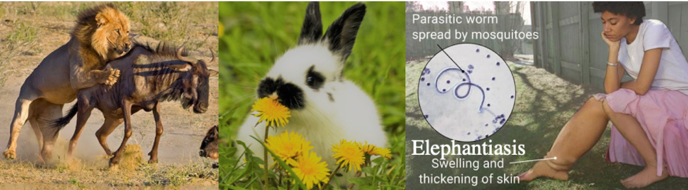

---
class: center, middle

## Is this a predator-prey interaction?

```{r echo=FALSE, out.width='55%'}
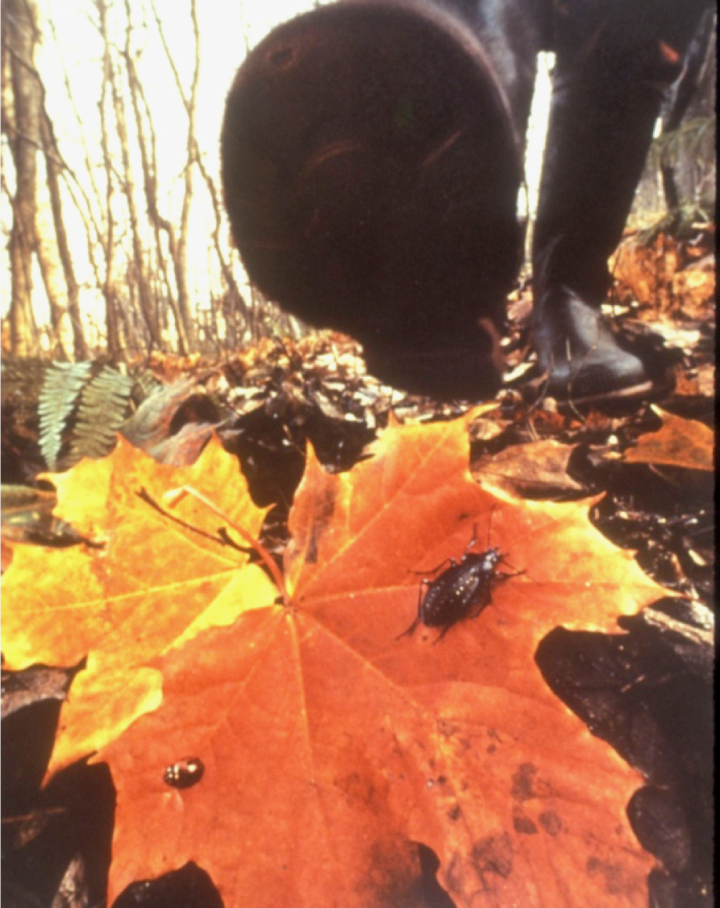
```


---

# Predator-prey cycles

```{r fig1, out.width = '70%'}
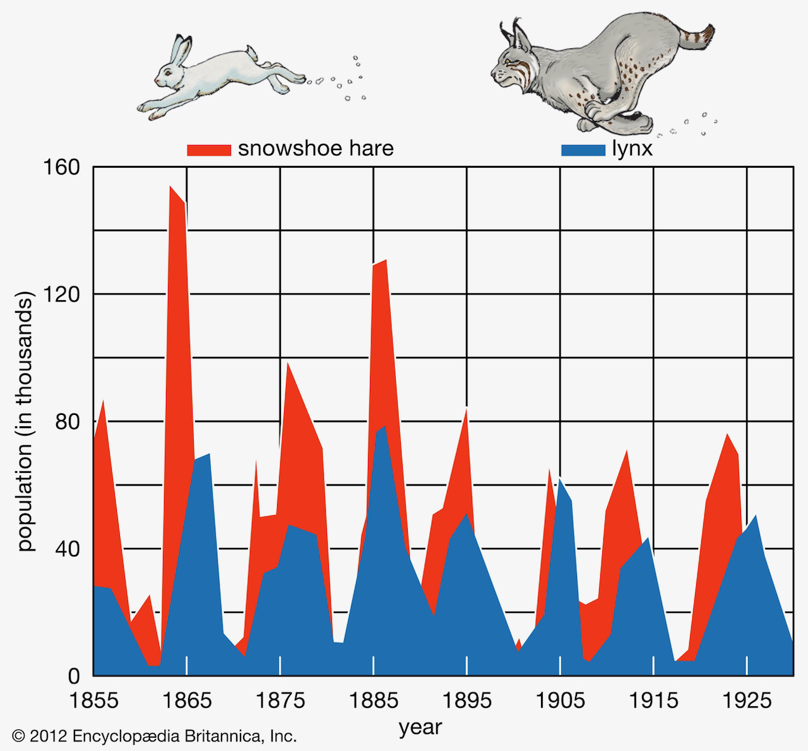
```

---

# Lotka-Volterra model

.pull-left[
.font200[Predator (Consumer)]

.font120[$$ \frac{dC}{dt} = -qC $$]


.font120[$$ \frac{dC}{dt} = - qC + caCR $$]

]

.pull-right[
.font200[Prey (Resource)]

.font120[$$ \frac{dR}{dt} = rR $$]


.font120[$$ \frac{dR}{dt} = rR - aCR $$]
]

--

.font150[The consumer and resource oscillate together through time, with the consumer lagged forward in time relative to the resource dynamics.]

---

# Equilibrium


.pull-left[
.font200[Predator (Consumer)]

.font120[
\begin{align}
\frac{dC}{dt} & = caCR - qC   \\
0 & = caCR - qC \\
caCR & = qC \\
caR & = q \\
R* & = \frac{q}{ca} 
\end{align}
]

]

.pull-right[
.font200[Prey (Resource)]

.font120[
\begin{align}
\frac{dR}{dt} & = rR - aCR \\
0 & = rR - aCR \\
aCR & = rR \\
aC & = r \\
C* & = \frac{r}{a} 
\end{align}
]
]

--

.pull-left[
.font150[
Predator population will be stable when the number of preys equals the ratio of the predator's mortality rate and its attack times conversion rate.
]
]

--

.pull-right[
.font150[
Prey population will be stable when the number of predators equals the ratio of the prey's growth rate and predator's attack rate.
]
]

???

Predator population will increase if R* > q/ca, decrease if R* < q/ca

Prey popualation will increase if C* < r/a, decrease of C* > r/a

---

# Predator-prey models predict stable limit cycles

```{r figCycle}
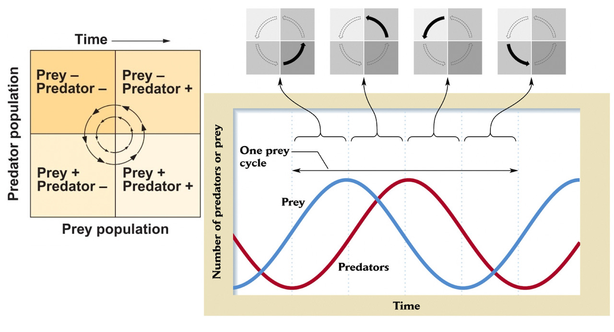
```

---

<!-- # Empirical examples? -->

<!-- - Snowshoe Hares and Lynx -->
<!-- - Huffaker's mite experiments -->
<!-- - Parasitoid-host cycles -->

# Model assumptions

.font200[
- Resource population only limited by predator

- Predator (_C_ ) only eats the one resource _R_

- Individual predators consume infinite number of _R_

- Encounter of predator _C_ and resource _R_ is random and "well-mixed" (homogenous habitats)
]

---

# How can we make the L-V model more realistic?

.font120[ Individual predators consume infinite number of _R_]

```{r figtype1, out.width='55%'}
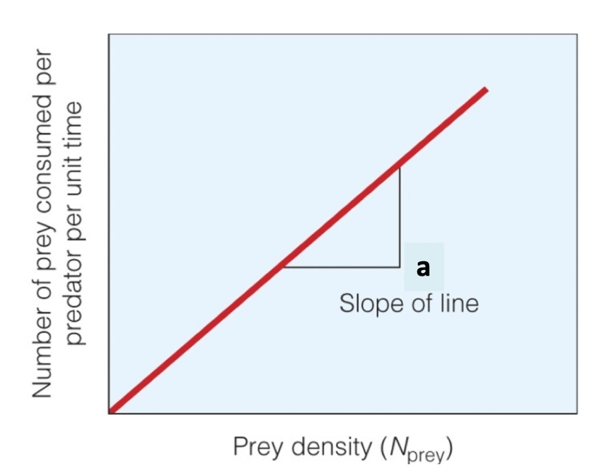
```

--

.font150[Type I _functional response_ (relationship between the density of prey and an individual predator's rate of resource consumption)]


---

# Functional response types

```{r figtypes, out.width='90%'}
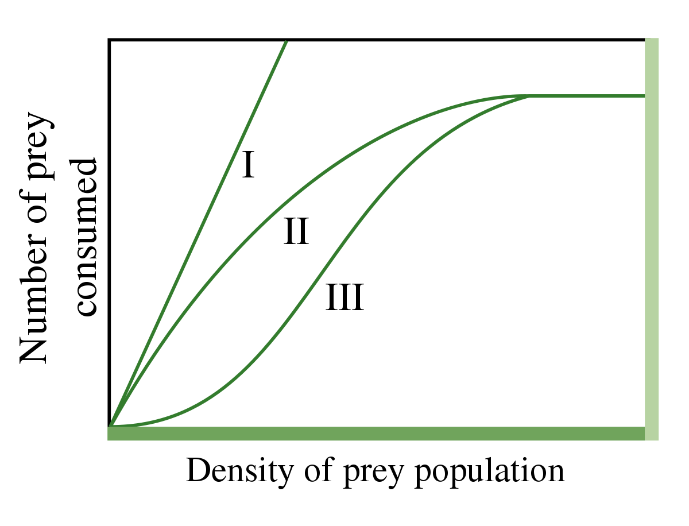
```

---

# Why predators don't kill all their prey?

--

.font150[Because this would cause their own extinction?]

--

.font150[Or even further, some may say that the predators actually act in the best interest of the prey by removing the "old and sick."]

--

.font150[.red[Wrong!] Because predators do not act this way, nor should they.]


???

Predators faced with the choice between killing prey and starving, or having their offspring starve, should always kill the prey.

---
background-image: url('figs/prime.png')
background-position: 80% 100%
class: right, middle, inverse

.pull-right[
## .blue[Why predators don't kill all their prey?] .red[Because they can’t.]
] 


---

# Why predators don't kill all their prey? .red[Because they can’t.]

.font200[1 Prey defense]

.pull-left[
```{r figdefense}
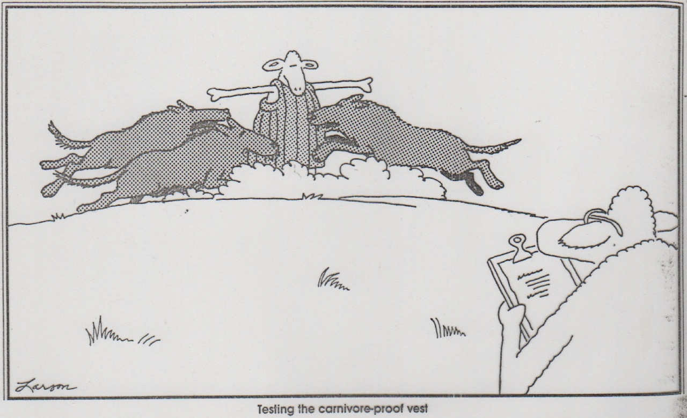
```
 
.center["Testing the carnivore-proof vest"]
]

.pull-left[
```{r figdefense2, out.width='70%'}
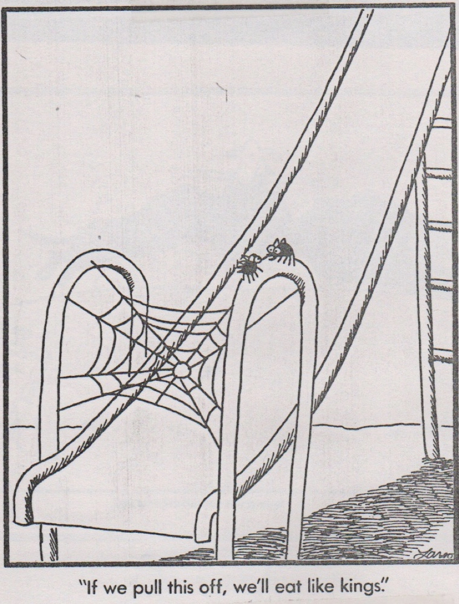
```
 
.center["If we pull this off, we'll eat like kings."]
]

---

# Why predators don't kill all their prey? .red[Because they can’t.]

.font200[1 Prey defense]

.font200[2 Complex habitats]


```{r fighabitat, out.width = '60%'}
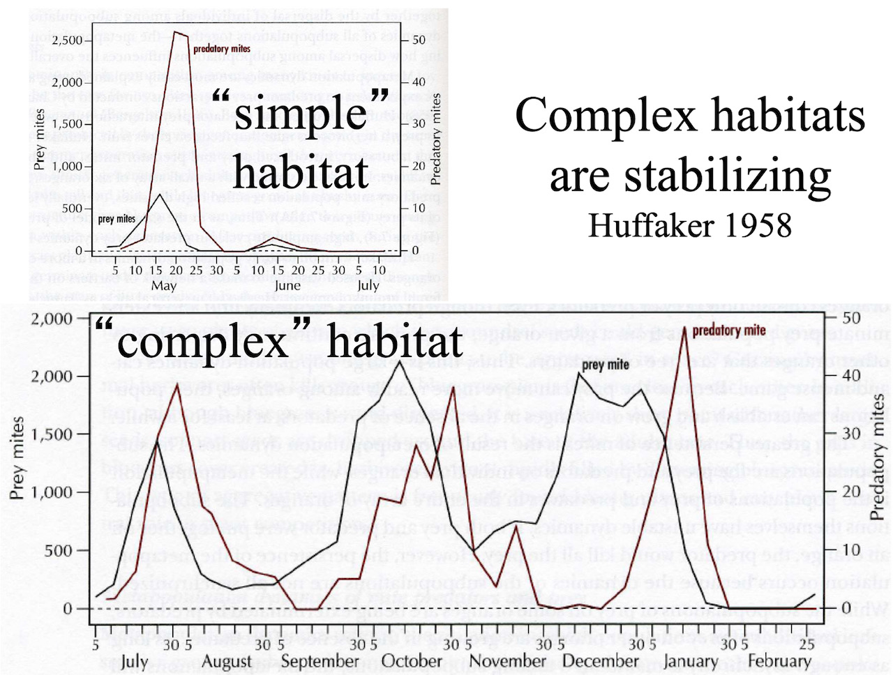
```


---

# Why predators don't kill all their prey? .red[Because they can’t.]

.font200[1 Prey defense]

.font200[2 Complex habitats]

.font200[3 Predators have their own predators]


???

The density of sp B can’t get high enough to drive sp A extinct because of sp C.

---

# Food web

```{r figfoodweb}
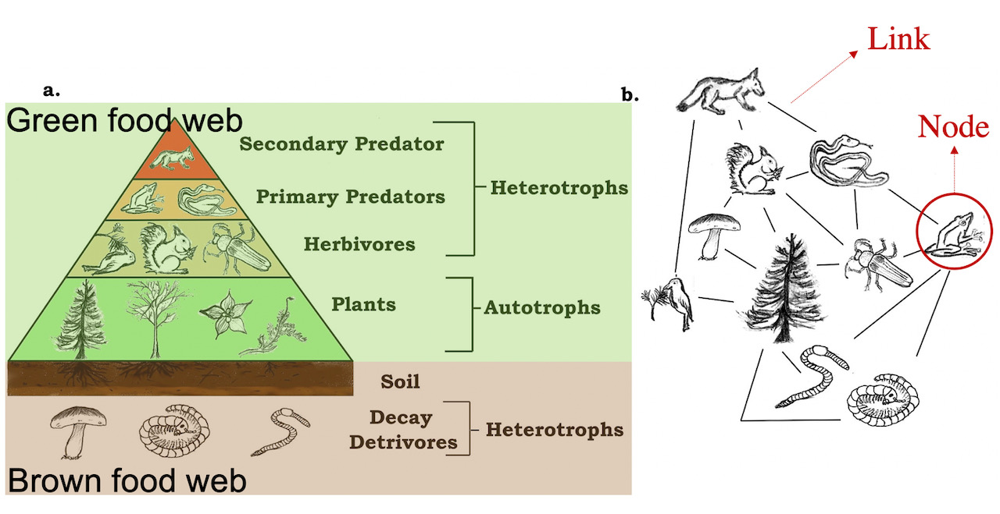
```

---

# Types of food webs

.font200[
- Connectedness food web

- Energy flow food web

- Functional food web
]

---

# What controls food webs?

```{r figenergyweb}
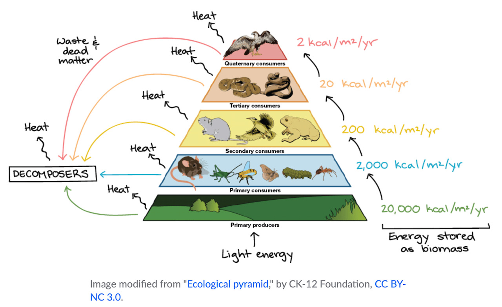
```

.font150[Energy; disturbance; ecosystem size; etc.]

---

# Pyramid structure

```{r fig3, out.width = '90%'}

```

---

# Trophic cascades

### Changes in abundances of organisms at one trophic level can influence energy flow at multiple trophic levels

.pull-left[
.font150[
- Top-down
- Bottom-up
]

```{r figdeer, out.width = '100%'}
knitr::include_graphics("figs/deerclosure.png")
```
Benefits to humans of removing a top predator << damage inflicted by a mesopredator/herbivor that become more abundanct after the top predator declines.
]

.pull-right[
```{r figcascade, out.width = '80%'}
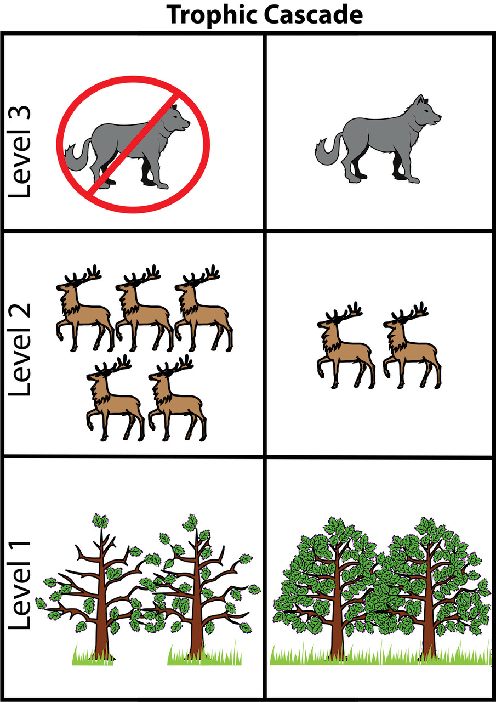
```
]

---
class: center, middle
# Question

## .red[Do clear predator-prey cycles occur frequently in nature?]
