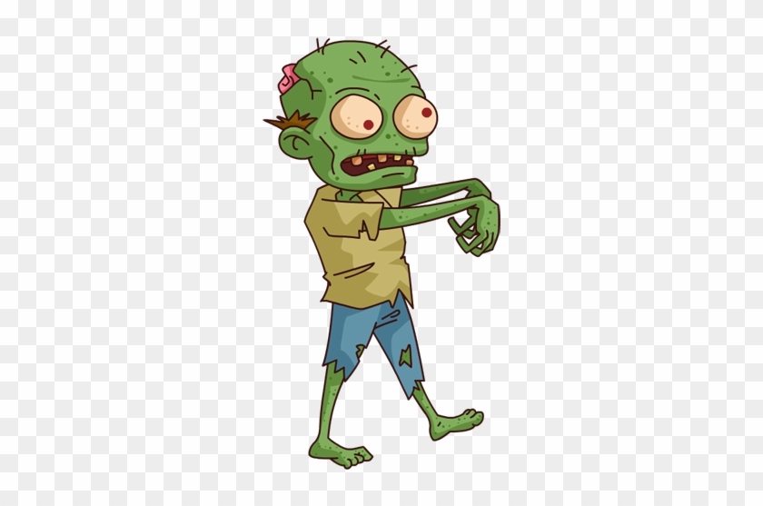
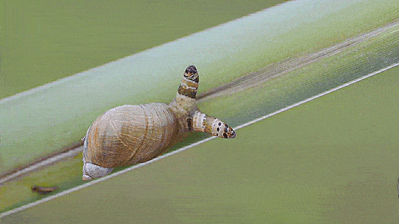
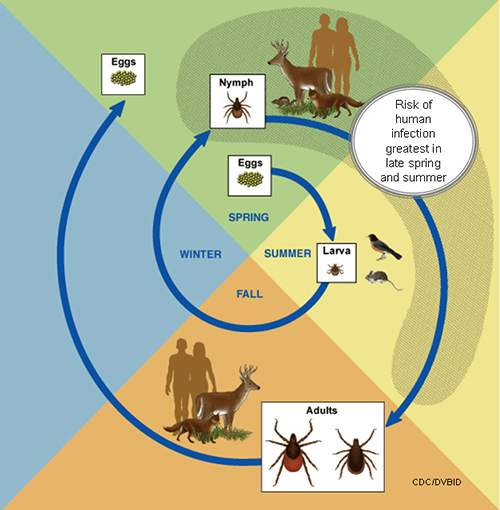
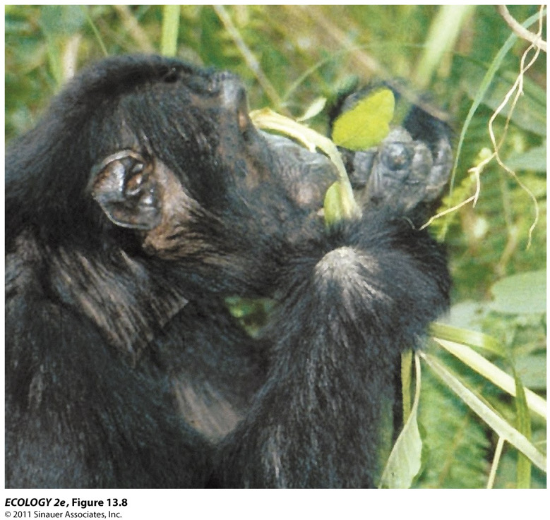
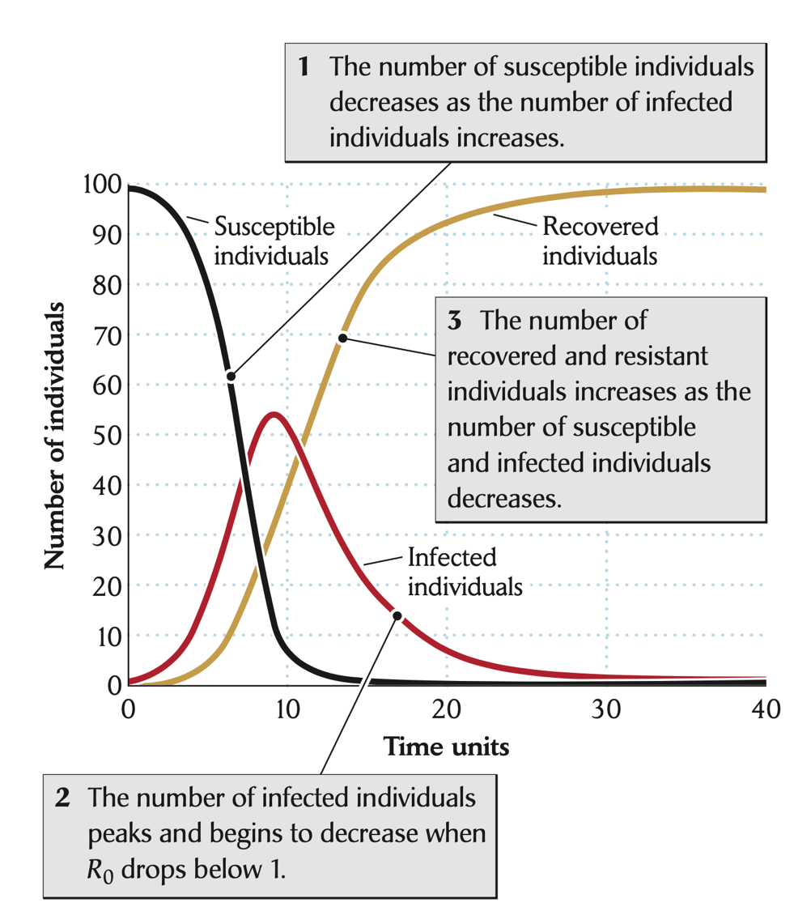

class: left, middle

```{r setup, include=FALSE}
options(htmltools.dir.version = FALSE)
knitr::opts_chunk$set(fig.align='center', echo = FALSE, out.width = '95%')
```

background-image: url('figs/covid.png')
background-position: 50% 50%
background-size: contain
class: center, middle, inverse

# Pandemic

---


# Parasite-Host Interactions 

.font200[
1. Effects of parasites
2. Types of parasites
3. Modeling parsite-host interactions
4. Parasite-host coevolution
5. Disease controls
]

---
class: center, middle


.pull-left[

### Zombie Movies
]

--

.pull-right[


### [Zombie in nature](https://www.wired.com/2014/09/absurd-creature-of-the-week-disco-worm/)
]

---

# Parasite, pathogen, infection, and disease

.font200[.red[parasite]: an organism that lives in or on another organism (.green[host]) and causes .blue[harmful] effects as it consumes resources from the host.]   .font150[(consumer-resource)]

--

.font200[When parasites colonize a host, that host is said to harbor an .red[infection]]

--

.font200[Only if that infection gives rise to symptoms that are clearly harmful to the host should the host be said to have a .red[disease], e.g., COVID-19]

--

.font200[.red[Pathogen]: any parasite that causes a disease (i.e. is ‘pathogenic’), e.g., SARS-CoV-2]


???

though infection by a pathogen does not always result in an infectious disease; asymptomatic

---

# Parasites are diverse

### Pretty much every organism of living thing has one or more parasite, including parasites (_hyperparasite_)

--

### Many parasites are host-specified or at least have a limited range of hosts (_specialists_); few has a broad range of hosts (_generalists_)

--

### The conclusion seems _unavoidable_ that .red[more than 50%] of the species on the earth, and many more than 50% of individuals, are parasites


---

# Effects of parasites

### Large toll on people: >25% human deaths are caused by infectious disease; 100 million people died in 1918 (the Great Influenza Pandemic caused by H1N1 virus); >2 million deaths caused by COVID-19 so far

### On wildlife: bird flu; chytrid fugus caused extinctions of amphibian species; white-nose syndrome for bats

### On plants: crops (e.g., wheat rust), trees (e.g., chestnut blight, dutch elm disease)

???

american chestnut trees used to be >50% of trees in temperate forests; now they are rare since the introduce of chestnut blight around 1900 from Asian

---

# Types of parasites

.font130[
- By location 
  + .blue[ectoparasites]: live on the outside of organisms (e.g., ticks, mites, lice, fleas, mistletoes) 
  + .blue[endoparasites]: live inside organisms (e.g., virus, cestode), often cause diseases
]

--

.font130[
- By size
  + .blue[microparasites]: small and often intra-cellular, reproduce directly within host and are often extremely numerous (e.g., virus, some types of bacteria and protists)
  + .blue[macroparasites]: larger, live on or within a host (in cavities such as the gut or inter-cellular), do not reproduce in their host (e.g., helminth worms in an intestine, some types of fungi, bacteria and protozoa)
]

--

.font130[
- By transmission mode
  + .blue[horizontal]: move between individuals other than parents and offsprings
  + .blue[vertical]: transmitted from a parent to its offspring
]

???

tradeoffs: exposure to natural enemies, external envi, difficulty to move among host, ease of feeding on hosts

---
class: center

# Parasite life cycle complexity



---

# The parasite niche

### Multidimensional space of tolerances and requirements of a species (abiotic and biotic)

### Niche --> understand and predict geographic distribution

### Niche --> understand host range and predict host switching; _spillover_ if the host switching involves the ability to infect a human host

.font130[
- the Great Influenza Pandemic in 1918 (H1N1 virus from birds)
- HIV (virus from chimpanzees)
- SARS in 2003 (SARS-CoV from bats?)
- COVID-19 (SARS-CoV-2 from ?)
]


---

# Hosts as habitats

.font130[Hosts as reactive environments: resistance, recovery, and immunity]

```{r, out.width='60%'}

```


???

Chimpanzees infected with nematodes seek out and eat a bitter plant that contains chemicals that kill or paralyze the nematodes

---

# The consequences of host reaction: S-I-R

## .red[S] : susceptible individuals

## .red[I] : infectious individuals

## .red[R] : recovered (and immune) individuals

### .blue[Costs of parasitism don’t have to involve death.]

---

# S-I-R model

.pull-left[
.font150[
\begin{align}
\frac{dS}{dt} & =  -\beta SI \\
\frac{dI}{dt} & =  \beta SI - dI \\
\frac{dR}{dt} & =  dI
\end{align}
 ]
]

--

.pull-right[]

---

# S-I-R model

.pull-left[
.font150[
\begin{align}
\frac{dS}{dt} & =  -\beta SI \\
\frac{dI}{dt} & =  \beta SI - dI \\
\frac{dR}{dt} & =  dI
\end{align}
 ]
]

.pull-right[
## Model assumptions

- A well-mixed population
- Same susceptibility for every individual
- No births of new susceptible individuals
- Permenant immunity after recovering

]

---

# $R_0$

.pull-left[
.font150[
\begin{align}
\frac{dS}{dt} & =  -\beta SI \\
\frac{dI}{dt} & =  \beta SI - dI \\
\frac{dR}{dt} & =  dI
\end{align}
 ]
]

.pull-right[
.font150[
$\frac{dI}{dt}>0$ only if $\beta SI > dI$

$R_0 =  \frac{\beta SI}{dI} = \frac{\beta S}{d}$

$\frac{1}{d}$: the average duration of infection
]
]

--

### $R_0$: .green[the number of secondary infections generated by a single infected individual in a wholly susceptible population]

### It provides a powerful framework for exploring the dynamics and control of epidemics

---

# $R_0$ of COVID-19 by 23 May, 2020

```{r}
knitr::include_graphics("figs/r0_usa.jpeg")
```

Ives and Buzzuto, 2021 
https://www.nature.com/articles/s42003-020-01609-6

---

# How do we reduce $R_0$?


