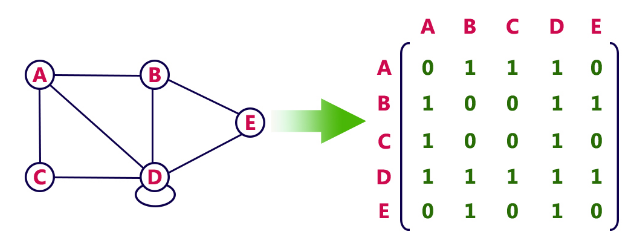
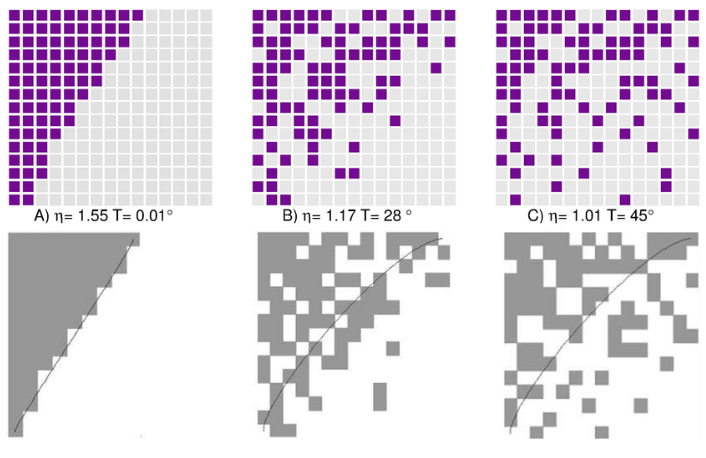

```{r knitr_options, include=FALSE}
library(knitr)
opts_chunk$set(fig.align='center', cache = FALSE, warning = FALSE,
        message = FALSE, echo = FALSE, out.width = '95%')
options(digits = 3, width = 88)
if(!require(bookdown)) install.packages("bookdown")
```

\thispagestyle{fancy}

# Reading:

Delmas, Eva, et al. "Analysing ecological networks of species interactions." Biological Reviews 94.1 (2019): 16-36. 

<https://onlinelibrary.wiley.com/doi/pdf/10.1111/brv.12433>

_We will mainly focus on material from pages 1-13._


# General overview of network ecology

Ecological networks are not entirely new to us this semester. We previously discussed them briefly with regards to food webs, where we described the interactions among species as a _directed_ network, where energy flowed from one species (node) to another via a feeding interaction (_a link_). However, networks can provide a more general representation of interactions between multiple species. Using a standardized set of tools from graph theory (the study of graphs/networks founded in mathematics and computer science), we can begin to disentangle the complex interactions among species.

```{r fig1, out.width = '100%'}
knitr::include_graphics("figs/netTypes.png")
```

# How to represent interactions as networks

There are two main types of networks that are relevant to the study of ecological systems. First, _unipartite_ networks consist of a single node type, and can be used to examine interactions among species within a population or among connected populations. Within a population, this would correspond to a social network, where links between individuals consist of links between individuals. These links can also represent dispersal pathways in a metapopulation, which we discussed previously with the Levins' model. Meanwhile, _bipartite_ networks represent the interactions between two different types of nodes, which don't interact with one another (explicitly), but interact with the other node type. This is a really common way to represent interactions between host and parasite species, for example. Links between species in a network can be _directed_ or _undirected_, where directed links depict a direct flow of energy from A to B, but not from B to A. Meanwhile, undirected links simply provide evidence of an interaction between the two species (the weight of the link is assumed to be the same from A to B as from B to A. 

Links in a network, apart from being directed or undirected, may be either binary (referred to as "unweighted" edges) or have some property describing the rate or amount of information flow (or strength of interaction; referred to as "weighted" edges).


# Why represent interactions as networks?

This may seem like a needless abstraction, but representing interactions in network form is incredibly useful. For one, this is a way to handle the complexity of a system that would otherwise be intractable. Second, the analytical tools developed for networks allow the detection of both large scale (network-level) structure, as well as quantification of species-level contributions to the overall network. We will go over both of these, and provide examples of the insights that can be gained from representing species interactions as ecological networks. 


# Unipartite networks

Unipartite networks represent the interactions between nodes of the same class. For example, think of a social contact network (real or online), which describes links between friends or people in close proximity. The study of social (and sexual) contact networks is incredibly important in understanding disease transmission and spread. For instance, when we described the SIR model in a previous lecture, a major assumption of this model was that the population was "well-mixed". This essentially means that all individuals are assumed to be connected, such that the probability of transmission from an infected individual to a susceptible individual is assumed to be equal. But this isn't really how disease transmission works, right? People who come into direct contact with infected individuals are more likely to become infected, and an infected person who contacts nobody is not much of a risk to the whole population. Using networks, it is possible to identify individuals most important for disease transmission and spread, allowing targetted vaccination or treatment. This serves to reduce the vaccination threshold to much lower than estimated by the SIR model. 

_**An example:**_ Controlling infectious disease in wildlife populations is a bit tough, as we often cannot sample the entire population, much less vaccinate enough individuals against disease. So identifying individuals most likely to spread disease is important. This may require detailed information on social contacts. Or we could use proxy variables, which are known individual traits associated with the number of social contacts. For example, in primate social networks, traits such as sex, age, and family size were all related to the number of contacts an individual had. This suggests that targeting vaccination efforts to individuals with certain traits is one way to reduce parasite burdens. 

<https://royalsocietypublishing.org/doi/full/10.1098/rsif.2014.0349>

This representation of a network of interconnected populations also provides a new set of analytical tools for metapopulations. That is, much of the study of metapopulations developed independently of network theory, despite similar aims. This lead to the development of identical measures with different names, which is never a good thing in science. For instance, metapopulation studies often calculate the **connectivity** of a node (population) as the sum of all the dispersal links between a specific node. In the study of networks, this is referred to as **degree** (a form of **centrality**, which we discuss further below). But while connectivity is one measure, there are numerous ways to measure centrality, depending on what aspect of the node the user considers to be important. 


# Bipartite networks

Bipartite networks represent the interactions between two classes of nodes. Often, this refers to the interactions between trophic levels; host-parasite, consumer-resource, plant-pollinator, etc. However, this can be generalized to include site-species networks, allowing a link between species distribution modeling (which we discussed previously in the niche lecture) and the study of networks. Bipartite networks are incredibly useful in describing the complex associations between sets of species, and have a variety of use cases. For one, trait or phylogenetic information can be mapped onto nodes (species) in the network to start to get at what constrains a link between species. That is, plant-pollinator relationships may be limited by the physical attributes of both species. Imagine a pollinator with a very long probiscus. This pollinator species may be specialized to pollinate flowers with very deep corollas (flower tubes) that other pollinators simply can't use. 


# Common measures of networks

Regardless of network type, there are a common set of statistics which can be calculated on ecological networks to provide some insight into network structure. For instance, the _connectance_ of the network measures the fraction of links that are realized of the full set of potential links (i.e, all possible links between nodes in the network). This measure starts to get at how specialized interactions in the network are. In the extreme case, in a bipartite network where species only interact with one other species (highly specialized) the connectance is incredibly low. In the context of social or disease transmission networks, connectance can start to get at the risk of an epidemic as less connected networks reduce the likelihood that an epidemic will occur. 

There are two other main measures of networks that ecologists routinely use; _modularity_ and _nestedness_. Before we can dive into this, let's think about how we formalize networks. A typical description is called an "adjacency matrix", in which each node is a row (and a column) in a square matrix describing links between nodes. 


$$A = \begin{pmatrix}
    1 & 1 & 0 & 0 & 1 & 0\\
    1 & 0 & 1 & 0 & 1 & 0\\
    0 & 1 & 0 & 1 & 0 & 0\\
    0 & 0 & 1 & 0 & 1 & 1\\
    1 & 1 & 0 & 1 & 0 & 0\\
    0 & 0 & 0 & 1 & 0 & 0\\
\end{pmatrix}$$


```{r fig2, out.width = '100%'}

```

_Modularity_ captures the tendency of species to form into groups of species which interact mainly within their own group. In unipartite networks, more modular metapopulations are less susceptible to disturbance, and can strongly reduce the size of epidemics. 

Let's consider a site x species matrix, which describes community composition across different sampling sites.

$$A = \begin{pmatrix}
    1 & 1 & 0 & 0 & 0 & 0\\
    1 & 1 & 1 & 0 & 0 & 0\\
    0 & 0 & 0 & 1 & 1 & 0\\
    0 & 0 & 0 & 1 & 1 & 0\\
    0 & 0 & 0 & 1 & 1 & 0\\
    0 & 0 & 0 & 1 & 0 & 1\\
\end{pmatrix}$$

Alright, and let's take it back to a unipartite network, such as a social contact network.

$$A = \begin{pmatrix}
    0 & 1 & 1 & 0 & 0 & 0\\
    - & 1 & 1 & 0 & 0 & 0\\
    - & - & 0 & 1 & 0 & 0\\
    - & - & - & 0 & 1 & 1\\
    - & - & - & - & 0 & 1\\
    - & - & - & - & - & 0\\
\end{pmatrix}$$

_Nestedness_ measures the tendency for species with fewer interactions to be a subset of those with more interactions. This is slightly confusing, until you sketch it out. 

Let's consider a site x species matrix, which describes community composition across different sampling sites.

$$A = \begin{pmatrix}
    1 & 1 & 1 & 1 & 1 & 1\\
    1 & 1 & 1 & 1 & 0 & 0\\
    1 & 1 & 1 & 1 & 1 & 0\\
    1 & 1 & 1 & 0 & 0 & 0\\
    1 & 1 & 0 & 0 & 0 & 0\\
    1 & 0 & 0 & 0 & 0 & 0\\
\end{pmatrix}$$


Alright, and let's take it back to a unipartite network, such as a social contact network.

$$A = \begin{pmatrix}
    1 & 1 & 1 & 1 & 1 & 1\\
    - & 1 & 1 & 1 & 1 & 1\\
    - & - & 0 & 0 & 1 & 1\\
    - & - & - & 0 & 1 & 1\\
    - & - & - & - & 0 & 1\\
    - & - & - & - & - & 1\\
\end{pmatrix}$$

```{r fig3, out.width = '100%'}

```


# Common measures of individual species within networks

Many times, we may want to know identify the most well-connected or "important" species in a network. Consider the case of a disease transmission network. If we can identify those individuals that are capable of spreading the parasite to a large number of people, we may wish to take pre-emptive measures to make sure that individual does not become infected. In bipartite networks, we may wish to focus conservation efforts on species which are most important for maintaining connections with other species. For instance, we may wish to conserve a generalist pollinator species, as this species may be responsible for pollinating a large number of species. Conserving a specialist pollinator will help only a small number of plants in their pollination. 

To get at species/site/node importance in networks, we can measure _centrality_, which attempts to quantify the importance of the node to the network. Centrality comes in many different types, depending on what aspect of the network we deem as important. For instance, in the disease transmission case above, we may wish to vaccinate or remove individuals with the highest number of contacts, corresponding to _degree_ centrality. 


Degree centrality: $k_i = \sum_{j=1}^{n} A_{ij}$


What if we don't care just about the immediate connections between nodes, but we want to know how well connected the node is to **all** nodes in the network? This is referred to as _closeness_ centrality.  

Closeness centrality: $k_i = \sum_{j!=i}^{n} \frac{n-1}{d_ij}$ 

where $n$ is the number of nodes in the network, and $d_ij$ is the shortest path length between $i$ and $j$.

However, we may also wish to remove individuals which serve as bridges between two modules (as detected by modularity or other means). This is especially relevant to disease control efforts which attempt to minimize network-wide infection. This measure of centrality is called _betweenness_.

As a final example, the importance of a species can be defined relative to the importance of the species it is connected to. This is, for instance, the method underlying how Google ranks webpages to show you in search results. The idea is that important websites are those connected to important websites. The algorithm, called PageRank, preferentially shows you webpages that are linked to by many other webpages, with the idea that pages that are referenced by a lot of others are probabably good. 

**Another conceptual way to examine species contributions** The measures above start to measure node importance to the network. Another way of doing this is to calculate a network-level property and then to compare it to what happens when you randomize the interactions of one node. This differs in an interesting way from centrality. Centrality measures the importance of a node to the overall network based on path distances to other nodes, while the approach we discuss now measures the importance of a node based on the degree of change each node can create in a network-level property. To measure the contribution of a species to network structure, we can simply calculate 

$$C_{i}=\frac{P-\bar{P_{i}}}{\sigma_{\bar{P_{i}}}}$$

# Error and attack tolerance

We discussed the measurement of individual nodes to network structure previously (in terms of centrality and contribution ($c_i$) to a network measure) in the context of infectious disease and vaccination targets. There are more reasons to consider node contributions to the network. One example is the concept of _error tolerance_ and _attack tolerance_ in networks. Error tolerance refers to the ability of a network to recover from the loss of a node. We can think about this in ecological systems as the extinction of a species, or the removal of an infected individual, and the downstream consequences of this. Error tolerance is normally used to assess how _robust_ a network is to node loss. Building robust networks is important (e.g., the internet, or a transportation network).

The other side of error tolerance is attack tolerance, or the robustness of a network to a targeted attack. This creates an interesting situation, where robust networks (those with high error tolerance) are actually more prone to failure under targeted attacks. This means that there is an inverse relationship between error and attack tolerance (more information from a classic paper <http://barabasi.com/f/77.pdf>). 


# How do we compare different nodes in their interactions?

Sometimes, we may wish to know if ecologically similar species have similar patterns of interactions. For instance, closely related host species may harbor an interact with a similar set of parasite species. We already have tools for this that we've learned when discussing measures of biological diversity. For instance, in a host-parasite network, degree centrality (discussed above) of a host species is equivalent to parasite species richness (a measure of alpha diversity), and the degree centrality of a parasite species is the same as host range (a measure of alpha diversity).

To compare species interaction patterns between species, we can implement ideas from beta diversity. We learned previously about Jaccard similarity. This value is bounded between 0 and 1, where the index is equal to 1 when two communities are identical, and 0 when the communities share 0 species. Here, we replace "species" with "interactions". 


$$ J(A,B) =  \frac{| A \cap	 B |}{| A \cup B|} $$

$| A \cap	 B |$ is the number of shared interactions between species $A$ and $B$, while $| A \cup B |$ is the total number of shared and non-shared interactions.


((work through an example in class)) 


Much like the examples of beta diversity we discussed, we can use this measure to assess the similarity of interaction patterns between two species, and then to relate this measure to ecological differences between species. The most obvious measure would be to measure the phylogenetic similarity between two host species (or plants or pollinators etc. etc.) and to examine the _distance decay_ relationship in beta diversity (interaction similarity) as a function of phylogenetic distance between species. 


((sketch this out))


# Assessing the potential consequences of realistic species loss

It is difficult to predict how an ecological system will change with the loss of a species (thinking specifically in terms of bipartite networks such as plant-pollinator or perhaps food webs as well). Predicting how a network will respond to the loss of node is important. In a simple sense, we would expect that the loss of a host (in a host-parasite network) might result in the extinction of specialist parasite species. However, the parasite (or pollinator or predator) may respond to the loss of it's only interactor by switching to a novel species (either host, plant, or prey, respectively). This is called "link re-wiring".

We can assess how we might expect a network to change over time by removing nodes from the network based on measured extinction risk. This measure would take into account birth rate, population density, and ecological needs (abiotic tolerances, etc.). We can then remove species that are estimated to go extinct first, and examine the changes to the network structure, assuming either that species do not "re-wire" (i.e., links are never added to the network, as species are assumed to not be able to change their interaction partners), or giving some probability that a novel interaction will form. This is an ongoing avenue of research, and is incredibly important considering the rate of environmental change and the homogenization of interaction networks (recall the Dornelas paper we referenced earlier in the semester). 
