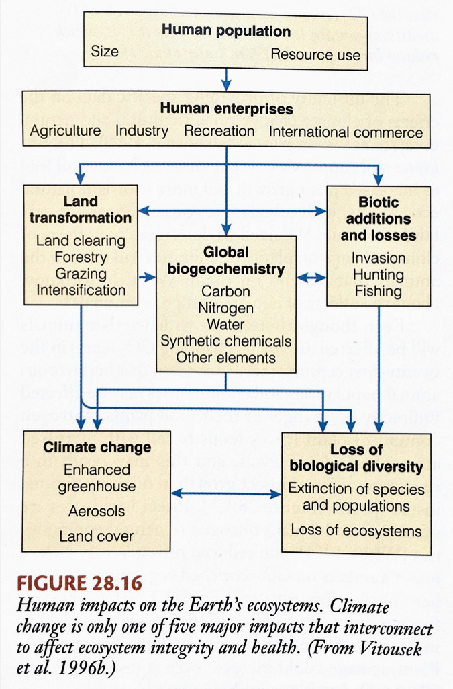
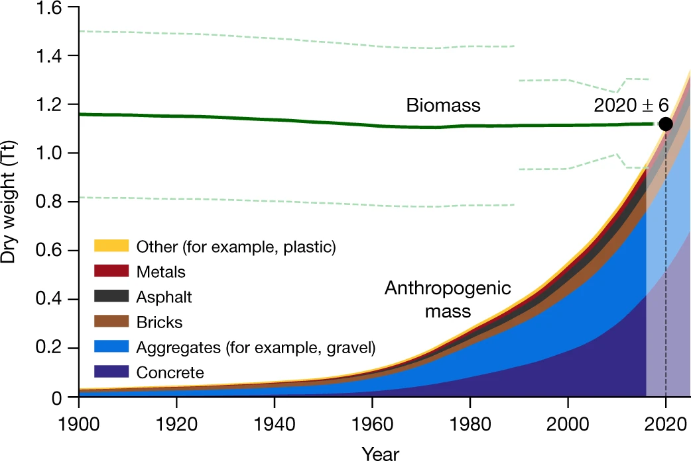
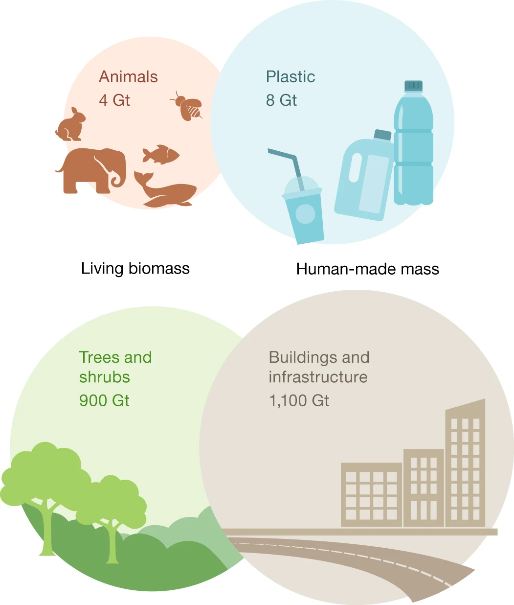
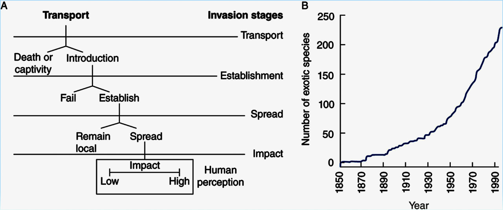
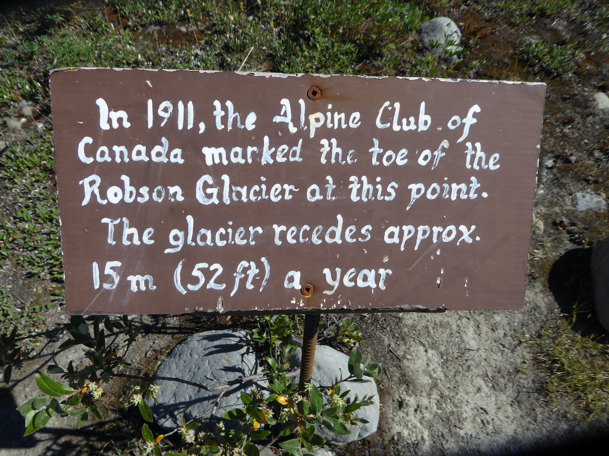
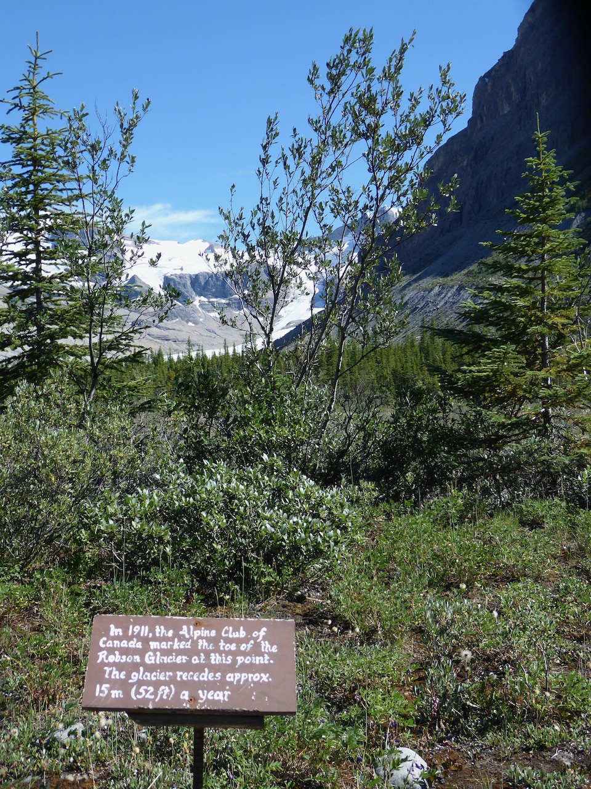
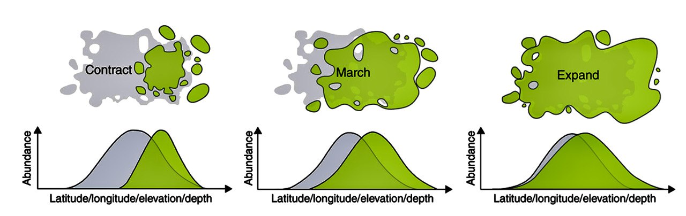

class: left, middle


```{r setup, include=FALSE}

options(htmltools.dir.version = FALSE)
knitr::opts_chunk$set(fig.align='center', echo = FALSE, out.width = '95%')

```


class: left, center, inverse

.font300[Announcements]  
+ 
+ 
+ 

---

background-image: url('https://upload.wikimedia.org/wikipedia/commons/6/6f/Katrina-noaaGOES12.jpg')
background-position: 50% 50%
background-size: contain
class: left, bottom, inverse

# Global Environmental Change

.font200[What are the problems?]  
.font200[What can we do about them?]


???

Throughout this course, we have touched on many environmental change problems, from land use change to pest control to species diversity loss. This lecture will bring these environmental change problems into central focus and we will briefly talk about _what are the problems?_ and _what can we do about them?_

these issues are not separate from each other

The total value of global ecosystem services is estimated to be ~125 trillion US dollars per year; while global gross domestic product (GPD) in 2012 is ~74 trillion $.

---

```{r out.width='57%'}

```


---

# Human Population Growth


.font200[Beyond exponential; Carry capacity?]  https://ourworldindata.org/world-population-growth

???

10-12 billion


---
class: center

# Welcome to the .red[Anthropocene]

<iframe src="https://player.vimeo.com/video/39048998" width="1000" height="500" frameborder="0" allow="autoplay; fullscreen; picture-in-picture" allowfullscreen></iframe>

???

The exponential growth of human population has led to increasing pressure on natural systems.

---
class: center, middle, inverse

# .font200[What are the .red[problems]?]

### Land use change

### Biological invasions

### Climate change

---

# .red[Land-use change]

Agriculture and urbanization since thousands years ago; accelerated in the last several hundred years [(Ellis et al. 2013)](https://www.pnas.org/content/110/20/7978)

```{r, out.width='80%'}
knitr::include_graphics('https://www.pnas.org/content/pnas/110/20/7978/F1.large.jpg?width=800&height=600&carousel=1')
```

---
class: middle

.pull-left[
## Global human-made mass exceeds all living biomass

]

.pull-right[

]

.right[[Elhacham et al. 2020](https://www.nature.com/articles/s41586-020-3010-5)]

???

gigatons

---

# .red[Consequences of land-use change]

.font200[
- Habitat lost for plant and animal

- Habitat fragmentation and associated problems

- Carbon emissions and consequences for climate change

- Even activities without dramatic land clearing can have large-scale effects: e.g., irrigation, dams
]

---

# .red[Biological Invasions]



.font200[Large ecological impacts (as predators, competitors, disease vectors, pathogens, etc.); > 120 billion $ loss per year in US]

???

e.g. fire ants

---
background-image: url('https://upload.wikimedia.org/wikipedia/commons/thumb/d/d5/Carbon_cycle.jpg/2560px-Carbon_cycle.jpg')
background-position: 50% 50%
background-size: contain
class: left, bottom

# [The Carbon cycle](https://earthobservatory.nasa.gov/features/CarbonCycle)

---
class: middle

.pull-left[
# Atmospheric CO<sub>2</sub> concentration


]

.pull-right[
.font200[
.blue[January 2021]

.center[.font200[.red[415.24]]]
]

parts per million (ppm)

Mauna Loa Observatory, Hawaii (Scripps UCSD)

Preliminary data released February 4, 2021
]

???

Atmospheric Carbon Dioxide

---
background-image: url('https://upload.wikimedia.org/wikipedia/commons/thumb/0/04/Greenhouse-effect-t2.svg/2880px-Greenhouse-effect-t2.svg.png')
background-position: 50% 0%
background-size: contain
class: right, bottom, inverse

<!-- .pull-left[ -->
<!-- ```{r out.width='45%'} -->
<!-- knitr::include_graphics('https://www.epa.gov/sites/production/files/2020-04/gases-by-source-2020-caption.jpg') -->
<!-- ``` -->
<!-- ] -->

.font300[Greenhouse effect]  
.font120[Increase in the concentration of greenhouse gases (e.g., CO<sub>2</sub> (.cyan[81%] emission), CH<sub>4</sub> (.cyan[10%] emission, .red[80x CO<sub>2</sub>]), N<sub>2</sub>O (.cyan[7%] emission, .red[300x CO<sub>2</sub>]), chlorofluorocarbons CFCs (.cyan[3%] emission, .red[5000x CO<sub>2</sub>])) will warm the Earth]

???

O<sub>3</sub>, 

Global Warming Potentials https://www.epa.gov/ghgemissions/understanding-global-warming-potentials

---
class: center

# Long-term association between CO<sub>2</sub> and temperature


--

## .blue[Association is not causation]

---

# The main evidence for anthropogenic climate change is from Global Climate Models

```{r out.width='70%'}
knitr::include_graphics('https://upload.wikimedia.org/wikipedia/commons/thumb/d/db/Global_Temperature_And_Forces.svg/2560px-Global_Temperature_And_Forces.svg.png')
```


---

# .red[Climate Change: a major environmental issues of our time]

## Global Climate Models: .red[4-11 °F by 2100] (10-100 times faster than natural)

## 5°F: hottest in 100,000 years

## 9°F: hottest in 1,000,000 years

--
.blue[
## Cold regions will get hotter

## Dry regions will get drier
]

---

# Some impacts of climate change

.font200[
1. Sea levels will rise
1. Hurricanes will increase
1. Extreme weather will be more frequent
1. Fire regimes in the US West will change
1. Increased CO<sub>2</sub> will acidify oceans
1. Species: adjust, adapt, move, die
1. Changes in species interactions
]

???

1. Plant growth and phenology will change

---

# .red[Sea level rise]

.pull-left[
.font150[
Thermal expansion  
Melting glaciers  
Melting Greenland and Antarctica  
]
]


---
class: middle

.pull-left[
# Melting Glacial

]

.pull-right[

]

---
background-image: url('figs/ice3.jpeg')
background-position: 50% 40%
background-size: contain
class: center, bottom

---

# .red[Sea level rise]

.pull-left[
.font150[
Thermal expansion  
Melting glaciers  
Melting Greenland and Antarctica  

Current: 8 inches above 1880  
2050: another 6-16 inches  
2100: another 12-48 inches

Sea level will rise even after global temperatures stabilize
]
]

.pull-right[


]

---

# .red[Hurricanes will increase]

.font200[Hurricane Katrina in 2005 caused over 1800 deaths (~1200 from Louisiana) and $125 billion in damage.]

```{r out.width='60%'}
knitr::include_graphics('https://www.gfdl.noaa.gov/wp-content/uploads/pix/user_images/tk/mb_science_a.png')
```

---

# .red[Extreme weather will be more frequent]

.pull-left[
.font200[Heatwavers, heavy rain and flooding, drought, and paradoxically, extreme cold
]

[Climate change and record cold: What's behind the arctic extremes in Texas](https://www.cbsnews.com/news/climate-change-texas-winter-storms-arctic-cold/)

<blockquote class="twitter-tweet"><p lang="eu" dir="ltr">Frozen Louisiana <a href="https://t.co/RemKOtQMb6">pic.twitter.com/RemKOtQMb6</a></p>&mdash; The duck girl (@Louisianaboater) <a href="https://twitter.com/Louisianaboater/status/1361811452215123974?ref_src=twsrc%5Etfw">February 16, 2021</a></blockquote> <script async src="https://platform.twitter.com/widgets.js" charset="utf-8"></script>
]

.pull-right[

]

???

a warmer climate may have actually contributed to the extreme cold

---

# .red[Fire regimes in the US West will change]

```{r out.width = '60%'}
knitr::include_graphics('https://files.wri.org/s3fs-public/uploads/fires-us-cumulative-burned-area-2020-wri.gif')
```


---

# .red[Fire regimes in the US West will change]

```{r out.width = '60%'}
knitr::include_graphics('https://files.wri.org/s3fs-public/uploads/fires-emissions-climate-feedback-loop-wri.png')
```


???

Higher temperatures draw moisture out of live and dead trees and brush, making them more flammable. The heat also can alter precipitation, as well as shift spring thaw earlier, lengthening the fire season. 

---

# .red[Ocean Warming and Acidification]


.font200[A problem for ocean ecosystems and commercial industries like oyster farms]

???

less carbonate ions (co32-) to build shells

shells and skeletons can even begin to dissolve

---

# .red[Species: adjust, adapt, move, die]

.pull-left[
.font200[.green[Adjust]: changes that occur during an .blue[individual]'s lifetime, typically not passed down to offspring; sometimes referred to as _acclimation_, _acclimatization_, or _plastic_ responses]
]

.pull-right[
.font200[.green[Shifts in phenology]]


]

---

# .red[Species: adjust, adapt, move, die]

.pull-left[
.font200[.green[Adapt]: .blue[populations] become better suited to environmental conditions they experience via heritable genetic change over generations

Adaption is necessary for species' long-term persistence as they struggle to survive in environmental change]
]

.pull-right[
.font200[.green[Adaption by natural selection]]


]

---

# .red[Species: adjust, adapt, move, die]

.font200[.green[Move]]

--

.font200[.green[Die]: fail to adjust, adapt, or move; loss of individuals, populations, and species]

.font200[Human-mediated extinction rates are accelerating: .red[sixth mass extinction]]


---

background-image: url('../09_plantPollinator/figs/econet.jpeg')
background-position: 50% 50%
background-size: contain
class: left, top

# .red[Changes in species interactions]

???

phenological mismatch, trophic mismatch, etc.


---

# What can we do?

## Waste less, eat less meat, drive less, fly less, buy less

--

## .red[Don’t doubt the science]

.font130[
>"It's clap-trap.  Far too many people in the Government and media are far too willing to listen to and amplify any claim of doom by someone who's wearing a white coat."  
> .right[-Rep. Dana Rohrabacher  
	Chairman of the House   
	Subcommittee on the  
	Environment, 1995]
]

???

Human impacts on the planet's ecosystems are dramatic and growing. During our life time, these impacts will led to the most significant problems facing the global. One may feel angry about the past, hopeless about the future. But I think our huge impacts on environment also reveals our collective power and the large potential to make our future better. I think now is a fascinating time to be a scientist because never before we have had such significant and complex impacts on the ecosystems, while at the same time we also have powerful tools to solve issues and conserve life. Whether or not you pursue a career in Global Change Biology, I hope this lecture will help us to be more informed citizens. Together, we can make our future better and sustainable.

---

# Some website

.font200[
- [Images of change](https://climate.nasa.gov/images-of-change?id=212#212-pedersen-glacier-melt-alaska)

- [GLOBAIA: planetary awareness through science and art](https://globaia.org)
]
