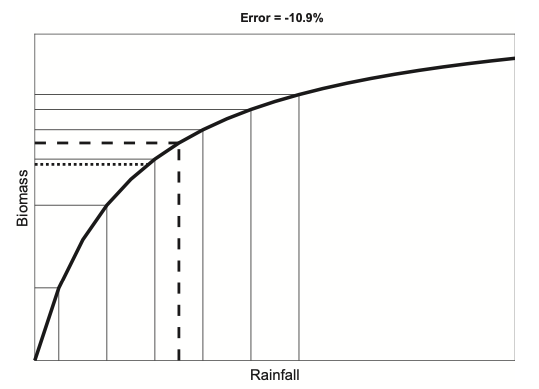
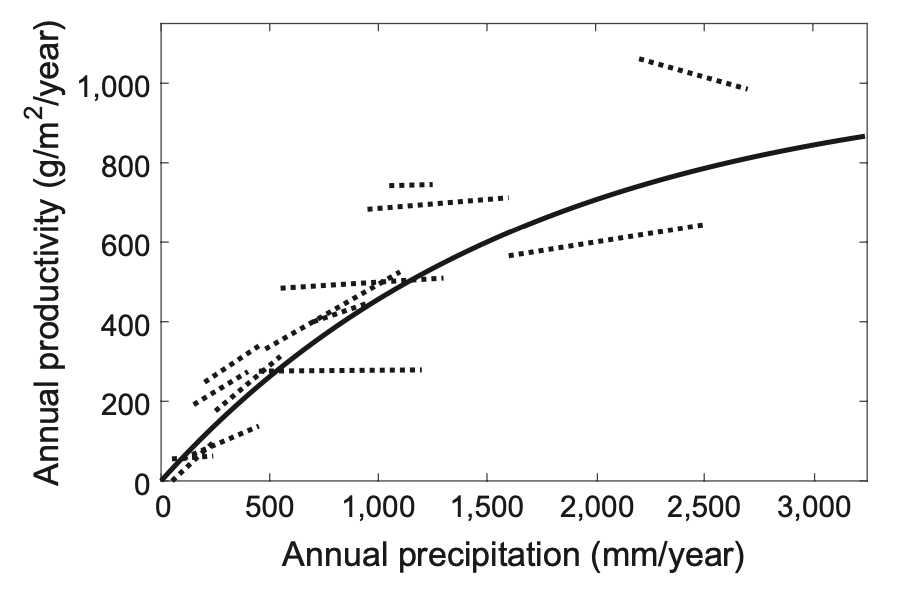
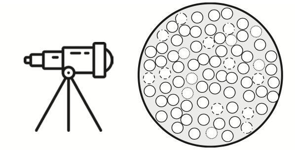
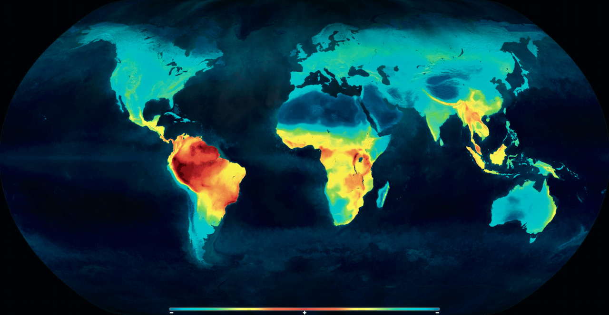
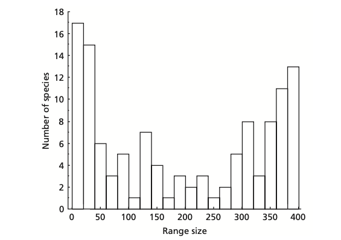
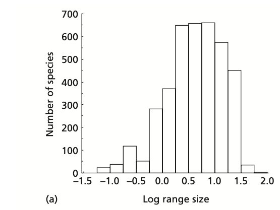
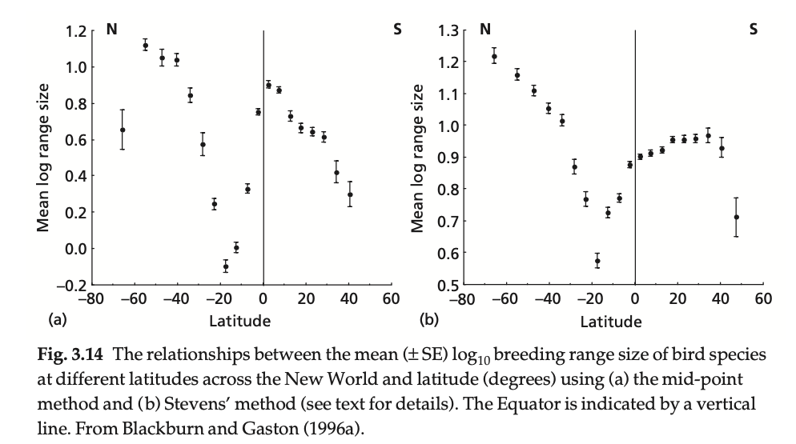
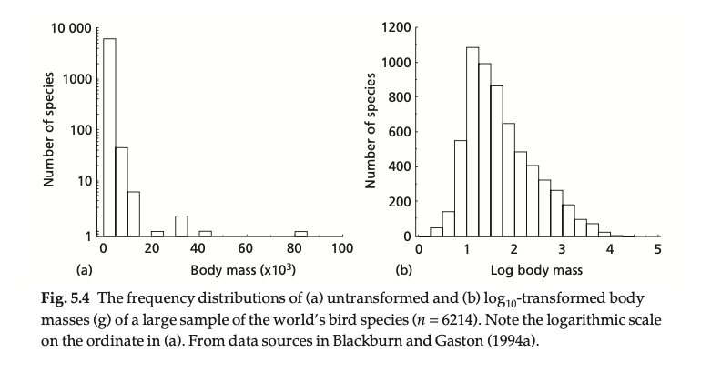
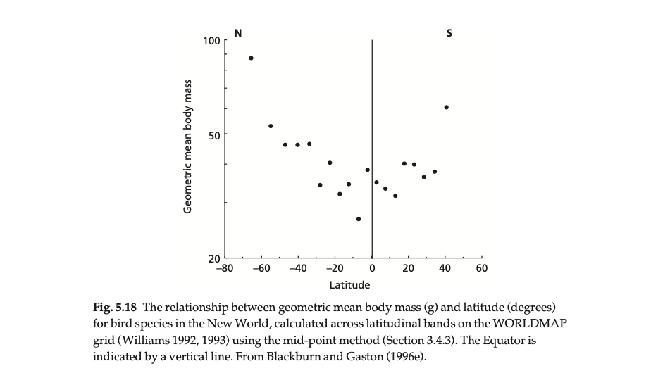
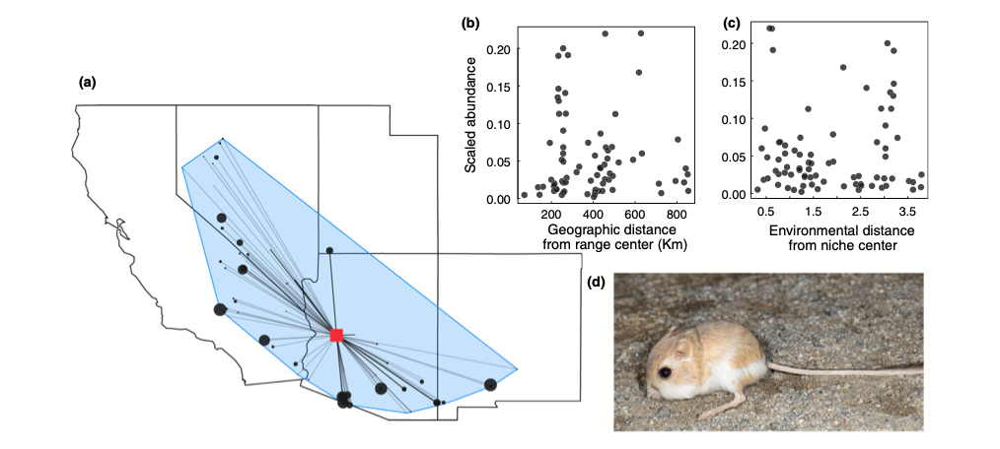

class: left, middle

```{r setup, include=FALSE}
options(htmltools.dir.version = FALSE)
knitr::opts_chunk$set(fig.align='center', echo = FALSE, out.width = '95%')
```
class: middle

# What is .green[Macro]ecology?

.font200[
>Macroecology is a way of studying relationships between organisms and their environment that involves characterizing and explaining statistical patterns of abundance, distribution, and diversity.
> .right[Jim Brown 1995]
]

???

the prefix "macro" for two reasons. 1) in order to characterize patterns in the statistical distributions of variables among individuals, populations, or species, it is usually necessary to work at relatively large spatial and/or temporal scales so as to obtain sufficiently large samples. 2) in order to investigate the implications of important advances in other disciplines such as biogeography, paleo-biology, systematics, and the earth sciences, it is necessary to expand the scale of ecological research.

Macroecology differs from most of recent and current ecology in its emphasis on statistical pattern analysis rather than experimental manipulation


---
class: middle

.font200[
>McGill, Brian J. ".green[The what, how and why of doing macroecology]." _Global Ecology and Biogeography_ 28.1 (2019): 6-17.
]

---

# View 1: Macroecology = the ecology of large scales


.font200[
.red[How large is large enough? Extent? Grain?]
]

---

# View 1: Macroecology = the ecology of large scales

```{r fig1, out.width = '100%', fig.cap = "The dimensionality of macroecology. Figure taken from McGill (2019) https://doi.org/10.1111/geb.12855."}
knitr::include_graphics("figs/macro.jpg")
```

---

# View 1: Macroecology = the ecology of large scales

## Macroecology does not require to be big simultaneously in all dimensions

## Large needs to be defined relative to the organisms involved.

## Notion of .blue[dozens]: dozens of generations (time), population (space), species (taxa)


---

# View 2: Macroecology = a statistical, emergent, non-reductionist approach

.font200[
>Macroecology is a big-picture, statistical approach to the study of ecology. By focusing on broadly occurring patterns and processes operating at large spatial and temporal scales and ignoring localized and fine-scaled details, macroecology aims to uncover general mechanisms operating at organism, population and ecosystem levels of organization.
> .right[Smith et al. 2008]
]

???

In the reductionist view, adequate modelling of the components should always reproduce all emergent phenomena.

---

# View 2: Macroecology = a statistical, emergent, non-reductionist approach

.font140[The .red[transmutation] problem: scaling up is challenging because of .red[Jensen's inequality] (the average of a function is not the function of the average)] $\overline{f(x_i)}\neq f(\overline{x_i})$

.center[]

---

# View 2: Macroecology = a statistical, emergent, non-reductionist approach



???

the claim that macroecology can be explained by individuals and population dynamics can be demonstrated rigorously to be possible only rarely, owing to the transmutation problem

---

# View 3 by McGill 2019

## Macroecology is the study at the aggregate level of aggregate ecological entities made up of large numbers of particles in the pursuit of generality

.center[]

---

# Macroecological 'laws'

.font200[
- Species richness

- Species Range

- Body size

- Abundance

]

---

# Latitudinal gradients in species richness


.right[[Mannion et al. 2014](https://www.sciencedirect.com/science/article/pii/S0169534713002358)]

.font120[This pattern of increasing species diversity from the poles to the tropics is remarkably consistent across numerous marine and terrestrial taxa (plants, fish, birds, mammals, and many invertebrate groups) and has also persisted across much of both modern and deep time.]

???

Distribution of extant terrestrial vertebrate species showing the high concentration of diversity in equatorial regions


---

# Hypotheses

.font150[

Speciation and extinction rates determine species richness

- Climate: high solar energy, low seasonality --> high productivity --> high species richness (recall foodweb)

- Historical:  more time, less perturbed in the past by climatic events, accumulating species over time

- Geographic: larger and more heterogeneous areas in tropics

- Mid-domain effect: bounded geographical domain + random shifting species ranges --> mid-domain peak of species richness. Null models

]

--

.font200[.red[Not mutually exclusive]]  

--

.font200[Elevational gradient]

???

If species' ranges are randomly shuffled within a bounded geographical domain free of environmental gradients, ranges overlap increasingly toward the center of the domain, creating a “mid‐domain” peak of species richness.

---

# Species range

.pull-left[
## Range size distribution (small spatial scale)

]

.pull-right[
## Range size distribution (larger spatial scale)

]

---


# Spatial variation in range size

.font150[.blue[Rapoport's rule]: the tendency for species living at higher latitudes to have larger range sizes]



???


- Niche breath and inter-specific interactions: stronger competition in tropics leads to narrower niche; or more controlled by predators, parasites, and pathogens

---

# Body size

## Body size distribution



---

# Spatial variation in body mass

.font140[.blue[Bergmann's rule]: the tendency for a positive association between the body mass of species in a monophyletic higher taxon and the latitude inhabited by those species.]




???

Phylogeny I : Random ancestral colonization by a large-bodied species
Phylogeny II: Selective advantage of traits which are accidentally coupled with large body size
Dispersal ability: Small body mass is associated with low dispersal ability 
Heat conservation: Increased heat conservation of large-bodied species; the higher surface area to volume ratio of smaller individuals results in improved heat dissipation in hot environments 
Starvation resistance: Increased starvation resistance of large-bodied species

---
class: middle

# Evidence for Bergmann's rule is mixed

>.font200[Riemer, Kristina, Robert P. Guralnick, and Ethan P. White. "[No general relationship between mass and temperature in endothermic species](https://elifesciences.org/articles/27166)." Elife 7 (2018): e27166.]

---

# Species-abundance distributions (SAD)

.font150[The species abundance distribution (SAD) characterizes the distribution of abundances of all species within a sample or ecological community. ]

.pull-left[
### Histogram of abundance

.font130[Rare species are common; common species are rare]
]

--

.pull-right[
### Rank abundance distribution

.font130[Species richness and evenness]
]

???

Understanding the abundance and distribution of species is arguably one of the most fundamental goals of ecology. 


---

# Abundant-center hypothesis

.font150[The abundant center hypothesis states that species density should be highest in the center of species range]


.right[[Dallas et al. 2017](https://taddallas.github.io/papers/Dallas2017EcologyLetters.pdf)]

---
class: middle

# Evidence for Abundant-center hypothesis is mixed

>.font200[Dallas, T. A., Santini, L., Decker, R., & Hastings, A. (2020). [Weighing the Evidence for the Abundant-Center Hypothesis](https://journals.ku.edu/jbi/article/view/11989/13502). Biodiversity Informatics, 15(3), 81-91.]

---
background-image: url('http://conservationcorridor.org/wp-content/uploads/BDFFP_Amazon.jpg')
background-position: 50% 50%
background-size: contain
class: center, bottom, inverse


# .red[Macroecology in an era of rapid change]

### .font120[How would environmental changes such as climate change, land use change, and biological invasions affect species range, abundance, body size, and diversity, and ultimately, the human society?]
